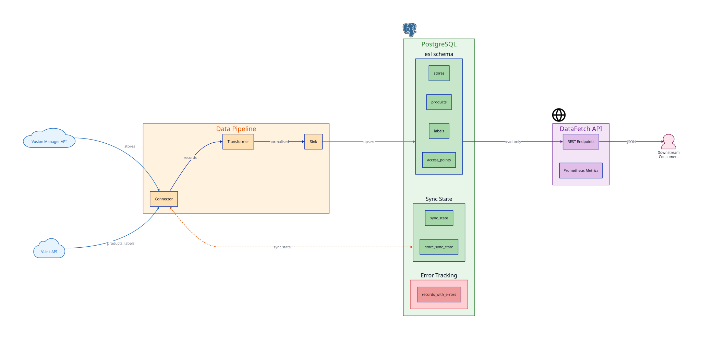

# System Architecture

## Overview

The ESL Orchestrator is a data integration platform that bridges the Vusion ESL ecosystem with Sonae MC's internal systems. It follows a three-stage architecture: **ingest**, **store**, and **serve**.

External ESL data flows through the platform in one direction:

1. The **Data Pipeline** connects to the Vusion Manager and VLink APIs to fetch store, product, label, and access point data
2. Fetched data is transformed and written to the **PostgreSQL database** using upsert semantics
3. The **DataFetch API** exposes the stored data to downstream consumers through a read-only REST interface

The pipeline runs as a Kubernetes CronJob on a configurable schedule. The API runs as a continuously available Deployment behind a Traefik ingress.

## Data Flow

The data flow follows two distinct paths:

**Ingest path** (Data Pipeline → Database):

1. The pipeline queries the Vusion Manager API to retrieve the list of stores
2. For each store, it queries the VLink API for products, labels, and access points
3. Records are normalised (field names converted to snake_case, internal fields removed)
4. Normalised records are written to PostgreSQL in batches using `INSERT ... ON CONFLICT DO UPDATE`
5. Synchronisation state is recorded per store to enable incremental sync on subsequent runs

**Serve path** (Database → DataFetch API → Consumers):

1. Consumers send POST requests to the DataFetch API specifying the entity, pagination, and optional search filters
2. The API validates the request against the entity registry, builds a parameterised SQL query, and returns the results as JSON

## Component Responsibilities

| Component | Type | Technology | Responsibility |
|---|---|---|---|
| **Data Pipeline** | CronJob | Go, Cobra, pgx | Fetch data from Vusion APIs, transform, and write to database |
| **Database** | Job (PreSync) | PostgreSQL 18, Flyway 12 | Schema management, data storage, sync state tracking |
| **DataFetch API** | Deployment | Go, Gin, pgx | Read-only REST API with pagination, search, and metrics |

## Environment Overview

The platform is deployed across three environments, each in its own Kubernetes namespace:

| Environment | Namespace | Purpose |
|---|---|---|
| **Development** | `instore-esl-orchestrator-dev` | Feature development and early testing |
| **Preproduction** | `instore-esl-orchestrator-pp` | Integration testing with production-like configuration |
| **Production** | `instore-esl-orchestrator-prd` | Live operations serving real store data |

All environments follow the same deployment topology managed by ArgoCD. Configuration differences (schedules, store filters, resource limits, hostnames) are controlled through environment-specific Helm values files.

## Technology Stack

### Languages and Frameworks

| Technology | Version | Used By |
|---|---|---|
| Go | 1.25+ | Data Pipeline, DataFetch API |
| PostgreSQL | 18 | Database |
| Flyway | 12 | Database migrations |

### Key Libraries

| Library | Purpose |
|---|---|
| **pgx/v5** | PostgreSQL driver with native protocol support and connection pooling |
| **Cobra** | CLI framework for the Data Pipeline |
| **Gin** | HTTP framework for the DataFetch API |
| **Zap** | Structured logging across all Go components |
| **OpenTelemetry** | Distributed tracing in the Data Pipeline |
| **Prometheus client** | Metrics instrumentation in the DataFetch API |

### Infrastructure

| Technology | Purpose |
|---|---|
| **Kubernetes** | Container orchestration |
| **Helm** | Deployment templating |
| **ArgoCD** | GitOps continuous delivery |
| **Traefik** | Ingress controller and TLS termination |
| **External Secrets Operator** | Vault-to-Kubernetes secret synchronisation |
| **HashiCorp Vault** | Secret storage (on-premise environments) |
