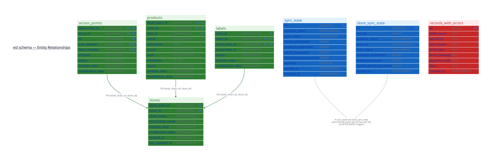

# Database

## Purpose

The database component manages the PostgreSQL schema that underpins the entire ESL Orchestrator platform. It stores all entity data synchronised from the Vusion ecosystem — stores, products, labels, and access points — as well as the synchronisation state used by the Data Pipeline to determine whether each store needs a full or incremental sync.

All schema changes are version-controlled using Flyway, ensuring reproducible and auditable migrations across environments.

## Technology Stack

| Technology | Version | Purpose |
|---|---|---|
| PostgreSQL | 18 | Relational database engine |
| Flyway | 12 | Versioned SQL migration framework |
| pg_trgm | (extension) | Trigram-based text search for fuzzy matching |

## Schema Overview

All tables live in the `esl` schema. The schema contains seven tables organised into three groups:

**Entity data** — synchronised from the Vusion APIs:

- `stores` — physical store metadata
- `products` — product catalogue per store
- `labels` — ESL label status, hardware, and transmission data
- `access_points` — radio transmitter hardware per store

**Synchronisation state** — used by the Data Pipeline to track sync history:

- `sync_state` — one row per pipeline run (aggregate metrics)
- `store_sync_state` — one row per store per run (enables per-store incremental sync)

**Error tracking**:

- `records_with_errors` — failed records captured for debugging and retry



## Table Details

### stores

The root entity. All other entity tables reference stores via a composite foreign key.

| Column | Type | Description |
|---|---|---|
| `retail_chain_id` | VARCHAR(50) | Retail chain identifier (PK) |
| `store_id` | VARCHAR(50) | Store identifier (PK) |
| `store_name` | VARCHAR(100) | Human-readable store name |
| `retail_chain_name` | VARCHAR(100) | Retail chain name |
| `software_setting_file_name` | VARCHAR(255) | Vusion software configuration file |
| `software_setting_version` | VARCHAR(50) | Software version |
| `software_setting_last_update` | TIMESTAMPTZ | Last software update |
| `creation_date` | TIMESTAMPTZ | Created in Vusion |
| `modification_date` | TIMESTAMPTZ | Last modified in Vusion |
| `created_at` | TIMESTAMPTZ | Row insertion timestamp |
| `last_updated_at` | TIMESTAMPTZ | Last upsert timestamp |

**Primary key:** `(retail_chain_id, store_id)`

**Indexes:** B-tree on `store_id`; GIN trigram on `store_name` and `retail_chain_name` for text search.

### access_points

Radio transmitter hardware installed in each store. Each access point communicates with nearby ESL labels.

| Column | Type | Description |
|---|---|---|
| `retail_chain_id` | VARCHAR(50) | Retail chain identifier (PK, FK) |
| `store_id` | VARCHAR(50) | Store identifier (PK, FK) |
| `id` | VARCHAR(50) | Access point identifier (PK) |
| `mac_address` | VARCHAR(50) | Hardware MAC address (unique) |
| `serial_number` | VARCHAR(100) | Hardware serial number (unique) |
| `channel` | VARCHAR(10) | Radio channel |
| `status` | VARCHAR(50) | Operational status |
| `connectivity_status` | VARCHAR(50) | Online/offline status |
| `connectivity_last_online_date` | TIMESTAMPTZ | Last seen online |
| `connectivity_last_offline_date` | TIMESTAMPTZ | Last went offline |
| `creation_date` | TIMESTAMPTZ | Created in Vusion |
| `modification_date` | TIMESTAMPTZ | Last modified in Vusion |
| `created_at` | TIMESTAMPTZ | Row insertion timestamp |
| `last_updated_at` | TIMESTAMPTZ | Last upsert timestamp |

**Primary key:** `(retail_chain_id, store_id, id)`\
**Foreign key:** `(retail_chain_id, store_id)` → `stores`

**Indexes:** B-tree on `store_id` and `id`; unique indexes on `mac_address` and `serial_number`.

### products

Product catalogue data linked to each store. Includes core product attributes and a set of custom fields used by Sonae MC's retail operations.

| Column | Type | Description |
|---|---|---|
| `retail_chain_id` | VARCHAR(50) | Retail chain identifier (PK, FK) |
| `store_id` | VARCHAR(50) | Store identifier (PK, FK) |
| `item_id` | VARCHAR(50) | Product item identifier (PK) |
| `id` | VARCHAR(300) | Vusion product identifier |
| `name` | VARCHAR(255) | Product name |
| `description` | TEXT | Product description |
| `brand` | VARCHAR(100) | Brand |
| `price` | NUMERIC(12,2) | Current price |
| `references` | TEXT[] | Reference codes (array) |
| `status` | VARCHAR(300) | Product status |
| `matching_count` | INTEGER | Number of label matches |
| `matching_matched` | BOOLEAN | Whether a label is matched |
| `matching_labels` | TEXT[] | Matched label IDs (array) |
| `custom_*` | various | 30+ custom fields for retail operations |
| `creation_date` | TIMESTAMPTZ | Created in Vusion |
| `modification_date` | TIMESTAMPTZ | Last modified in Vusion |
| `deletion_date` | TIMESTAMPTZ | Soft deletion date |
| `created_at` | TIMESTAMPTZ | Row insertion timestamp |
| `last_updated_at` | TIMESTAMPTZ | Last upsert timestamp |

**Primary key:** `(retail_chain_id, store_id, item_id)`\
**Foreign key:** `(retail_chain_id, store_id)` → `stores`

**Indexes:** B-tree on `item_id`, `status`, `creation_date`, `modification_date`, `custom_dept`, `custom_class`, `custom_subclass`, `custom_ticket_subtype`, `custom_status`; GIN on `description`, `name` (trigram), `references`, `matching_labels` (array).

### labels

ESL label data including hardware details, transmission history, product matching, and connectivity status.

| Column | Type | Description |
|---|---|---|
| `label_id` | VARCHAR(50) | Label identifier (PK) |
| `store_id` | VARCHAR(50) | Store identifier (PK, FK) |
| `retail_chain_id` | VARCHAR(50) | Retail chain identifier (PK, FK) |
| `transmitter_id` | VARCHAR(50) | Current access point |
| `previous_transmitter_id` | VARCHAR(50) | Previous access point |
| `status` | VARCHAR(50) | Label status |
| `hardware_type_name` | VARCHAR(100) | Hardware model |
| `hardware_battery` | VARCHAR(50) | Battery level |
| `package_*` | various | Package registration data |
| `transmission_*` | various | Transmission dates and history |
| `matching_*` | various | Product matching details |
| `connectivity_*` | various | Connectivity status and signal |
| `billing_activate_date` | TIMESTAMPTZ | Billing activation date |
| `last_join_timestamp` | TIMESTAMPTZ | Last network join |
| `creation_date` | TIMESTAMPTZ | Created in Vusion |
| `modification_date` | TIMESTAMPTZ | Last modified in Vusion |
| `created_at` | TIMESTAMPTZ | Row insertion timestamp |
| `last_updated_at` | TIMESTAMPTZ | Last upsert timestamp |

**Primary key:** `(store_id, retail_chain_id, label_id)`\
**Foreign key:** `(retail_chain_id, store_id)` → `stores`

**Indexes:** B-tree on `transmitter_id`, `matching_items_item_id`, `package_package_id`, `status`, `hardware_type_name`, `hardware_battery`, `matching_scenario_scenario_id`, `matching_items_modification_date`; GIN on `matching_items_references` (array).

### sync_state

Tracks aggregate metrics per pipeline execution. Used for operational monitoring and historical analysis.

| Column | Type | Description |
|---|---|---|
| `id` | BIGSERIAL | Auto-increment identifier (PK) |
| `pipeline_name` | VARCHAR(255) | Pipeline identifier |
| `sync_status` | VARCHAR(20) | success / failed |
| `stores_processed` | BIGINT | Number of stores processed |
| `products_processed` | BIGINT | Number of products processed |
| `labels_processed` | BIGINT | Number of labels processed |
| `access_points_processed` | BIGINT | Number of access points processed |
| `duration` | INTERVAL | Total run duration |
| `started_at` | TIMESTAMPTZ | Run start time |
| `finished_at` | TIMESTAMPTZ | Run end time |
| `error_message` | TEXT | Error details (if failed) |

**Retention trigger:** Automatically keeps only the last 20 rows per `pipeline_name`.

### store_sync_state

Tracks per-store sync history. The Data Pipeline queries this table to decide whether each store needs a full sync (no previous successful run) or incremental sync (fetch only records modified since the last run).

| Column | Type | Description |
|---|---|---|
| `id` | BIGSERIAL | Auto-increment identifier (PK) |
| `run_id` | BIGINT | Reference to the parent sync_state run |
| `pipeline_name` | VARCHAR(255) | Pipeline identifier |
| `store_id` | VARCHAR(255) | Store identifier |
| `sync_status` | VARCHAR(20) | success / failed / cancelled |
| `products_processed` | BIGINT | Products synced for this store |
| `labels_processed` | BIGINT | Labels synced for this store |
| `access_points_processed` | BIGINT | Access points synced for this store |
| `synced_at` | TIMESTAMPTZ | Sync completion time |
| `error_message` | TEXT | Error details (if failed) |

**Retention trigger:** Automatically keeps only the last 20 rows per `(pipeline_name, store_id)`.

### records_with_errors

Captures individual records that failed during sync for debugging and potential retry.

| Column | Type | Description |
|---|---|---|
| `id` | SERIAL | Auto-increment identifier (PK) |
| `table_name` | TEXT | Target table that rejected the record |
| `record_id` | TEXT | Identifier of the failed record |
| `sync_mode` | TEXT | full or incremental |
| `error_type` | TEXT | Error classification |
| `error_message` | TEXT | Error description |
| `detail` | TEXT | Detailed error context |
| `pg_error_code` | TEXT | PostgreSQL error code |
| `data` | TEXT | Raw record payload |
| `created_at` | TIMESTAMPTZ | Capture timestamp |

## Key Design Decisions

### Composite primary keys

All entity tables use composite primary keys that include `retail_chain_id` and `store_id`. This supports multi-tenant isolation at the row level — the same store number can exist in different retail chains without conflict.

### Upsert strategy

The schema is designed for `INSERT ... ON CONFLICT DO UPDATE` operations. The Data Pipeline writes data using upsert semantics, meaning records are inserted on first sync and updated on subsequent syncs. This makes the pipeline idempotent — re-running it produces the same result.

### Trigram text search

The `pg_trgm` extension enables GIN trigram indexes on text fields like `store_name`, `name`, and `description`. This allows efficient fuzzy text search through the DataFetch API without a dedicated search engine.

### Retention triggers

The `sync_state` and `store_sync_state` tables use `AFTER INSERT` triggers that automatically delete rows beyond the most recent 20 per key. This prevents unbounded growth of operational metadata while retaining enough history for debugging.

### PgBouncer compatibility

Migration `V1.0.0.13` sets `extra_float_digits` and `statement_timeout` at the database role level. This is necessary because PgBouncer strips unknown startup parameters from client connections, but the PostgreSQL JDBC driver (used by Flyway) sends these parameters at connect time. Without this workaround, Flyway connections through PgBouncer would fail.

## Migration Management

### Framework

Migrations are managed by Flyway and stored as versioned SQL files in the `sql/` directory.

### File naming convention

```
V{major}.{minor}.{patch}.{seq}__{description}.sql
```

- Double underscore (`__`) separates the version from the description
- Sequential numbering (`01`, `02`, ...) determines execution order
- Descriptions use `snake_case`
- Tables and their indexes are defined in separate migrations

### Current migrations

| Version | Description |
|---|---|
| V1.0.0.01 | Create `esl` schema |
| V1.0.0.02 | Enable `pg_trgm` extension |
| V1.0.0.03 | Create `stores` table |
| V1.0.0.04 | Create indexes on `stores` |
| V1.0.0.05 | Create `access_points` table |
| V1.0.0.06 | Create indexes on `access_points` |
| V1.0.0.07 | Create `products` table |
| V1.0.0.08 | Create indexes on `products` |
| V1.0.0.09 | Create `labels` table |
| V1.0.0.10 | Create indexes on `labels` |
| V1.0.0.11 | Create `records_with_errors` table |
| V1.0.0.12 | Create `sync_state` table with retention trigger |
| V1.0.0.13 | Configure PgBouncer compatibility |
| V1.0.0.14 | Create `store_sync_state` table with retention trigger |

### Rules

- **Never modify** an already-applied migration — Flyway validates checksums and will reject changes
- Always create **new migrations** for schema changes
- Flyway runs automatically as a Kubernetes PreSync hook before the Data Pipeline and DataFetch API are deployed
