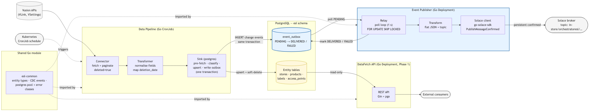

# System Architecture

## Overview

Phase 2 extends the ESL Orchestrator with a CDC (Change Data Capture) pipeline that detects data changes during each sync and publishes them as events. The existing Phase 1 architecture — ingest, store, serve — remains unchanged. Phase 2 adds a fourth stage: **detect and publish**.

The CDC pipeline uses the **transactional outbox pattern**: change events are written to an outbox table within the same database transaction as the data upserts, eliminating dual-write consistency problems. A separate Event Publisher service polls the outbox and delivers events to Solace.

## Architecture



## CDC Data Flow

The CDC data flow adds three steps to the existing upsert path:

1. **Pre-fetch** — Before upserting a batch, the sink queries the current state of the target rows within a database transaction
2. **Classify** — Each incoming record is compared against the pre-fetched state:
   - Existing `status` already `DELETED` and incoming `status` also `DELETED` → no event (skip fast)
   - Incoming `status` is `DELETED` (transition or initial full sync) → **DELETED** (payload: empty)
   - Key not found → **CREATED** (payload: full record snapshot)
   - Key found, fields differ → **UPDATED** (payload: changed fields as old/new diffs)
   - Key found, all fields identical → no event
3. **Outbox write** — Detected change events are inserted into `esl.event_outbox` within the same transaction as the upsert batch
4. **Publish** — The Event Publisher polls undelivered outbox rows, publishes each to Solace, and marks them as delivered

The transactional outbox guarantees that change events are only recorded when the corresponding data changes are committed. If the transaction rolls back, both the upsert and the outbox writes are discarded.

## Component Responsibilities

| Component | Type | Technology | Responsibility |
|---|---|---|---|
| **Data Pipeline** | CronJob | Go, pgx | Fetch data from Vusion APIs, transform, upsert, and detect changes (CDC) |
| **Database** | Job (PreSync) | PostgreSQL 18, Flyway 12 | Schema management, data storage, event outbox |
| **DataFetch API** | Deployment | Go, Gin, pgx | Read-only REST API (unchanged from Phase 1) |
| **Event Publisher** | Deployment | Go, pgx, Solace SDK | Poll outbox, publish events to Solace, mark delivered |
| **esl-common** | Go library | Go | Shared CDC event types and entity key definitions |

## Shared Library: esl-common

The `esl-common` module provides types and definitions shared between the Data Pipeline and Event Publisher, ensuring consistent serialisation and entity key handling.

**Module:** `github.com/sonaemc-instore/lac1041-instoreorchestrator_esl-common`

### Packages

**`event`** — CDC event types:

```go
type ChangeType string
const (
    ChangeTypeCreated ChangeType = "CREATED"
    ChangeTypeUpdated ChangeType = "UPDATED"
    ChangeTypeDeleted ChangeType = "DELETED"
)

type ChangeEvent struct {
    EventType  ChangeType        `json:"event_type"`
    EntityType string            `json:"entity_type"`
    EntityKey  map[string]string `json:"entity_key"`
    Payload    map[string]any    `json:"payload"`
    OccurredAt time.Time         `json:"occurred_at"`
}
```

**`entity`** — Entity type enumeration and composite business keys:

```go
type EntityType string
const (
    Store       EntityType = "store"
    Product     EntityType = "product"
    Label       EntityType = "label"
    AccessPoint EntityType = "accesspoint"
)

var ConflictKeys = map[EntityType][]string{
    Store:       {"retail_chain_id", "store_id"},
    Product:     {"retail_chain_id", "store_id", "item_id"},
    Label:       {"store_id", "retail_chain_id", "label_id"},
    AccessPoint: {"retail_chain_id", "store_id", "id"},
}
```

These conflict keys serve a dual purpose: they define the `ON CONFLICT` columns for upsert queries and the composite key included in each change event's `entity_key` field.

## Key Design Decisions

### Transactional outbox over CDC triggers

Database-level triggers (e.g., `LISTEN/NOTIFY` or logical replication) were considered but rejected in favour of application-level change detection with a transactional outbox. The outbox approach keeps all CDC logic in Go — where it can be tested, feature-flagged, and deployed independently — while guaranteeing atomicity with the upsert.

### Pre-fetch and in-Go classification

Detecting changes requires knowing the previous state of each record. Since UPDATED events carry a diff payload (`{"field": {"old": X, "new": Y}}`), pre-fetching the current rows is mandatory. Given that pre-fetch is already needed, classification (CREATED vs UPDATED vs unchanged) is performed in Go at negligible additional cost.

### Separate publisher service

The Event Publisher runs as its own Deployment rather than being embedded in the Data Pipeline CronJob. This decouples publish latency from sync execution, allows independent scaling and restarts, and means a Solace outage does not block data synchronisation.

### Horizontal scaling of the Event Publisher

The Event Publisher uses `SELECT FOR UPDATE SKIP LOCKED` to claim outbox rows. This naturally supports multiple replicas — PostgreSQL skips rows already locked by other transactions, so each replica automatically gets a distinct set of rows with no coordination needed. The only caveat is **event ordering per entity**: with multiple replicas, two events for the same entity could be picked up by different replicas and published out of order. If downstream consumers require per-entity ordering, this would need partitioning by entity key (e.g. consistent hashing). For now, a single replica is sufficient.

### Feature flag

CDC is gated behind a `cdc.enabled` configuration flag in the sink. When disabled, the pipeline behaves exactly as in Phase 1 — no transaction wrapper, no pre-fetch, no outbox writes.
