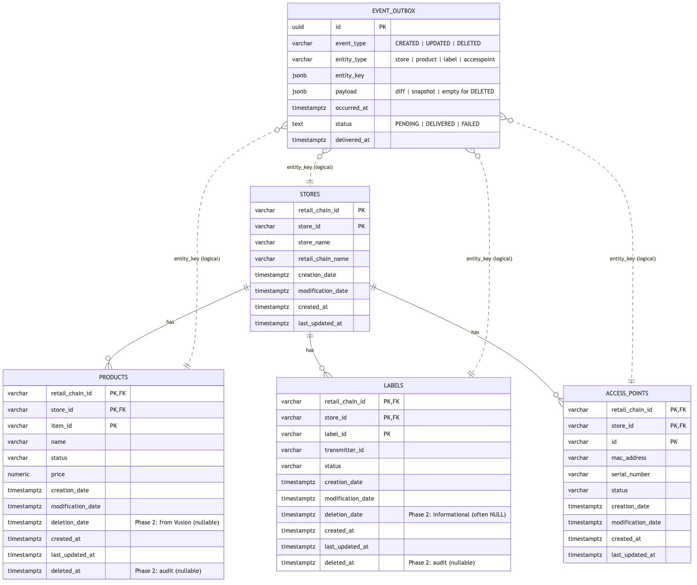
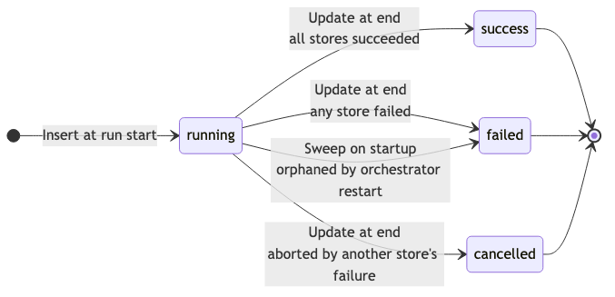

# Database

## Overview

Phase 2 adds a single new table — `event_outbox` — to the existing `esl` schema. This table implements the transactional outbox pattern: the Data Pipeline inserts change events into the outbox within the same database transaction as entity upserts, and the Event Publisher polls the outbox to deliver events to Solace.

All existing Phase 1 tables remain unchanged.



## Event Outbox Table

### event_outbox

Stores CDC events detected during pipeline execution. Each row represents a single CREATED, UPDATED, or DELETED event for one entity record.

| Column | Type | Default | Description |
|---|---|---|---|
| `id` | UUID | `gen_random_uuid()` | Unique event identifier (PK) |
| `event_type` | VARCHAR(20) | — | Change type: `CREATED`, `UPDATED`, or `DELETED` |
| `entity_type` | VARCHAR(50) | — | Entity that changed: `store`, `product`, `label`, `accesspoint` |
| `entity_key` | JSONB | — | Composite business key identifying the record (e.g., `{"retail_chain_id": "RC001", "store_id": "S001"}`) |
| `payload` | JSONB | — | Event payload — full snapshot for CREATED, changed-field diffs for UPDATED, empty `{}` for DELETED |
| `occurred_at` | TIMESTAMPTZ | `NOW()` | When the change was detected (defaults to transaction time) |
| `status` | TEXT | `'PENDING'` | Delivery status: `PENDING`, `DELIVERED`, or `FAILED` |
| `delivered_at` | TIMESTAMPTZ | `NULL` | When the event was published to Solace |

**Primary key:** `id` (UUID, database-generated)

**Constraint:** `CHECK (status IN ('PENDING', 'DELIVERED', 'FAILED'))`

The `id` column uses UUIDs rather than sequential integers. This enables deterministic event identifiers that can be included in published messages for downstream deduplication — consumers receiving the same event twice (at-least-once delivery) can use the UUID to discard duplicates.

The `status` column tracks delivery lifecycle explicitly. The Event Publisher transitions events from `PENDING` to `DELIVERED` (with `delivered_at` timestamp) after successful publication, or to `FAILED` for permanent errors. This explicit status model enables straightforward observability — a simple `GROUP BY status` reveals the outbox health at a glance.

### Payload format

**CREATED events** carry a full snapshot of the record:

```json
{
  "event_type": "CREATED",
  "entity_type": "product",
  "entity_key": {"retail_chain_id": "RC001", "store_id": "S001", "item_id": "P001"},
  "payload": {
    "name": "Leite Mimosa 1L",
    "price": 1.29,
    "status": "active",
    ...
  }
}
```

**UPDATED events** carry only the changed fields, with old and new values:

```json
{
  "event_type": "UPDATED",
  "entity_type": "product",
  "entity_key": {"retail_chain_id": "RC001", "store_id": "S001", "item_id": "P001"},
  "payload": {
    "price": {"old": 1.29, "new": 1.49},
    "status": {"old": "active", "new": "updated"}
  }
}
```

**DELETED events** carry an empty payload — the entity key identifies the deleted record, and the Event Publisher adds `eventId` and `send_date` at publish time:

```json
{
  "event_type": "DELETED",
  "entity_type": "product",
  "entity_key": {"retail_chain_id": "RC001", "store_id": "S001", "item_id": "P001"},
  "payload": {}
}
```

### Comparison scope

When determining whether a record has changed, the following columns are excluded from comparison:

- **Primary key columns** — they identify the record, not its content
- **Audit columns** — `created_at` and `last_updated_at` are set by the database on every upsert and do not reflect a meaningful data change

The source-provided `modification_date` column *is* included in comparisons, as it reflects when the record was last modified in the Vusion system.

## Indexes

Two partial indexes optimise the outbox's two access patterns:

```sql
CREATE INDEX idx_event_outbox_pending
    ON esl.event_outbox (occurred_at) WHERE status = 'PENDING';

CREATE INDEX idx_event_outbox_delivered
    ON esl.event_outbox (delivered_at) WHERE status = 'DELIVERED';
```

| Index | Purpose |
|---|---|
| `idx_event_outbox_pending` | Event Publisher queries: `SELECT ... WHERE status = 'PENDING' ORDER BY occurred_at` |
| `idx_event_outbox_delivered` | Retention cleanup: `DELETE ... WHERE status = 'DELIVERED' AND delivered_at < threshold` |

Partial indexes keep each index small — the pending index only covers rows awaiting delivery, and the delivered index only covers published rows. As events transition from `PENDING` to `DELIVERED`, they move from one index to the other.

## Retention

A stored function handles cleanup of delivered events:

```sql
CREATE OR REPLACE FUNCTION esl.cleanup_delivered_events(retention_days INT DEFAULT 7)
RETURNS BIGINT LANGUAGE plpgsql AS $$
DECLARE deleted BIGINT;
BEGIN
    DELETE FROM esl.event_outbox
    WHERE status = 'DELIVERED'
      AND delivered_at < NOW() - (retention_days || ' days')::INTERVAL;
    GET DIAGNOSTICS deleted = ROW_COUNT;
    RETURN deleted;
END; $$;
```

The function deletes outbox rows with status `DELIVERED` that were published more than `retention_days` ago (default: 7 days) and returns the number of deleted rows. It is designed to be called externally — by `pg_cron`, the Event Publisher, or an application-level scheduler.

Only delivered events are eligible for cleanup. Events with status `PENDING` or `FAILED` are never deleted, regardless of age, to prevent data loss.

## Migrations

| Version | Description |
|---|---|
| V1.0.0.15 | Strip composite `{retail_chain_id}.{store_id}` prefixes from existing data; add `retail_chain_id` to `store_sync_state` |
| V1.0.0.16 | Create `event_outbox` table (UUID primary key, status check constraint) |
| V1.0.0.17 | Create partial indexes on `event_outbox` (`occurred_at` for `PENDING`, `delivered_at` for `DELIVERED`) |
| V1.0.0.18 | Create `cleanup_delivered_events` retention function |
| V1.0.0.19 | Add `deletion_date` to labels; add `deleted_at` to products and labels |
| V1.0.0.20 | Increase entity ID columns (`item_id`, `label_id`, `access_points.id`) to VARCHAR(255) |
| V1.0.0.21 | Reset role-level `statement_timeout` set by V13 (see PgBouncer compatibility below) |
| V1.0.0.22 | Add correlation columns (`run_id`, `retail_chain_id`, `store_id`, `pipeline_name`, `entity_type`) and supporting indexes to `records_with_errors` |
| V1.0.0.23 | Drop the `UNIQUE` qualifier on `idx_ap_mac_address` and `idx_ap_serial_number`; both kept as plain B-Tree indexes for hardware-id lookups |
| V1.0.0.24 | Partition `sync_state` / `store_sync_state` retention triggers by `sync_status` (keep last 20 rows per status per partition key) |

These migrations follow the same conventions established in Phase 1: table and indexes in separate files, snake_case naming, all objects in the `esl` schema.

### PgBouncer compatibility (V1.0.0.13 + V1.0.0.21)

PgBouncer in transaction pool mode rejects any client whose `StartupMessage` carries unknown runtime parameters with `SQLSTATE 08P01`. Two parameters in particular show up in the wild:

| Parameter | Sent by | Resolution |
|---|---|---|
| `extra_float_digits = 3` | pgJDBC 42.x (Flyway) at startup | Stripped by PgBouncer's `ignore_startup_parameters`; restored server-side via V13's `ALTER ROLE ... SET extra_float_digits = 3` |
| `statement_timeout` | pgJDBC 42.x (Flyway) at startup | Stripped by PgBouncer's `ignore_startup_parameters`; **not** restored server-side — V13 originally set it to `'30s'`, V21 resets it (see below) |

V13's `statement_timeout = '30s'` line was a copy-paste of a JDBC-compat recipe and turned out to be a footgun: it pinned every future Flyway migration to a 30s server-side cap, which silently fails any legitimately long DDL (`CREATE INDEX CONCURRENTLY` on a large `esl.labels`, for example). V21 issues `ALTER ROLE %I RESET statement_timeout` against the same `current_user` V13 wrote to. After V13 + V21 apply, `pg_roles.rolconfig` for the migration user is `{extra_float_digits=3}` with no `statement_timeout`.

Per-query timeouts in the Go services are enforced via `context.Context` deadlines in application code, not via a server-side cap — so V21 sets no replacement value. The same reasoning is documented on `commonpg.NewPool`'s godoc.

The companion change in `esl-common` removed `RuntimeParams["search_path"]` from pool creation (it tripped the same 08P01 for every Go service); every consumer now qualifies its SQL via `commonpg.Schema` rather than relying on session `search_path`. See the `search-path-to-schema-qualified` plan for the full PR sequence.

### Deletion columns (V1.0.0.19)

Products and labels support soft-delete via dual timestamps:

| Column | Table | Description |
|---|---|---|
| `deletion_date` | products, labels | Business timestamp from Vusion — when the record was marked deleted. Reliably populated for products; may be NULL for labels (Vusion returns NULL even on confirmed-DELETED label rows) |
| `deleted_at` | products, labels | Audit timestamp — when the pipeline first detected the deletion. Set by `injectAuditTimestamps` on records with `status = 'DELETED'`; preserved on subsequent upserts via `COALESCE` |

Stores and access points have no deletion lifecycle in Vusion and do not have these columns.

## Key Design Decisions

### Single outbox table for all entity types

All entity types share one `event_outbox` table rather than having per-entity outbox tables. The `entity_type` column distinguishes between them. This simplifies the Event Publisher (one polling query), keeps migration count low, and avoids schema proliferation as new entity types are added.

### JSONB for entity_key and payload

Both `entity_key` and `payload` use JSONB rather than typed columns. This accommodates the varying composite key structures across entity types (2-column key for stores, 3-column key for products) and the variable shape of diff payloads without requiring schema changes.

### UUID primary key over sequential integer

A UUID primary key (`gen_random_uuid()`) was chosen over `BIGSERIAL` to provide deterministic event identifiers. The UUID is included in the published Solace message, enabling downstream consumers to deduplicate events under at-least-once delivery semantics — if the Event Publisher crashes after publishing but before marking the row as `DELIVERED`, the same event may be published again on restart, and consumers can detect the duplicate by its UUID.

### Explicit status column over NULL-based tracking

An explicit `status` column (`PENDING` → `DELIVERED` / `FAILED`) was chosen over using `delivered_at IS NULL` as the delivery indicator. The explicit model provides clearer semantics, enables a `FAILED` state for permanent errors, and simplifies observability — `SELECT status, COUNT(*) FROM event_outbox GROUP BY status` gives a complete health snapshot.

### Partial indexes over full indexes

Full indexes on `occurred_at` or `delivered_at` would include all rows. Partial indexes are more efficient because the outbox has a natural lifecycle: rows start as `PENDING` (matched by the pending index) and transition to `DELIVERED` (matched by the delivered index), then are eventually deleted by the retention function.

### Retention via function, not trigger

Unlike Phase 1's `sync_state` tables which use `AFTER INSERT` triggers for retention, the outbox uses an explicitly called function. This avoids adding cleanup overhead to every pipeline transaction — retention runs on its own schedule, independent of the write path. The trigger-based bounds for `sync_state` and `store_sync_state` are documented in [Run-history retention](#run-history-retention).

## Two state tables: `sync_state` vs `store_sync_state`

Two Phase-1 tables track sync state at different grains and both carry a `sync_status` column — a common source of confusion. The sections below describe each in detail.

| | `sync_state` (V1.0.0.12) | `store_sync_state` (V1.0.0.14) |
|---|---|---|
| Grain | One row per pipeline run | One row per `(pipeline_name, retail_chain_id, store_id)` sync |
| Status values | `running` → {`success`, `failed`, `cancelled`} (Phase 2) | `success` / `failed` / `cancelled` |
| Linked by | `id` is the run identity | `run_id` references `sync_state.id` (no FK — see below) |
| Retention | Last 20 per `(pipeline_name, sync_status)` | Last 20 per `(pipeline_name, retail_chain_id, store_id, sync_status)` |

## `store_sync_state` semantics

The Phase 1 `store_sync_state` table is unchanged structurally in Phase 2 but its `sync_status` column is now sourced from sink truth, not connector enqueue:

| Status | Trigger |
|---|---|
| `success` | Streaming finished AND every emitted record was acked with no persistence error |
| `failed` | Connector-side fetch error, OR sink-side persistence error (constraint violation, batch rollback), OR an "ack leak" where streaming finished but the pending counter is non-zero |
| `cancelled` | Streaming for the store never finished because another store's failure aborted the run |

Practically, this means a store whose labels triggered a unique-constraint violation in the sink now correctly surfaces as `failed` (with the PG error in `error_message`) rather than `success`. The watermark for that store does not advance, so the next run will retry the failed records.

The `*_processed` columns (`products_processed`, `labels_processed`, `access_points_processed`) reflect records that **persisted** in the destination, not records emitted to the sink channel.

## `records_with_errors` correlation columns

`esl.records_with_errors` gains five nullable columns so failed-record rows can be traced to the run, store, and pipeline that produced them:

| Column | Type | Description |
|---|---|---|
| `run_id` | BIGINT | Foreign-key-style reference to `sync_state.id` (no FK constraint — see below) |
| `retail_chain_id` | VARCHAR(255) | Chain the failed record belonged to, post-normalizer |
| `store_id` | VARCHAR(255) | Store the failed record belonged to. Stripped form (`000010`) — matches `products.store_id` / `labels.store_id`, **not** the composite `{retail_chain}.{store}` returned by Vusion |
| `pipeline_name` | VARCHAR(255) | Sourced from the orchestrator's pipeline config (set on the sink at construction) |
| `entity_type` | VARCHAR(32) | Free-form, populated from `record.Metadata["type"]` (`store`, `product`, `label`, `accesspoint`) |

Two indexes back the common query patterns:

```sql
CREATE INDEX idx_records_with_errors_run_id
    ON esl.records_with_errors (run_id);
CREATE INDEX idx_records_with_errors_store
    ON esl.records_with_errors (run_id, retail_chain_id, store_id);
```

All five columns are nullable. There are two reasons:

1. **Backward compatibility.** Pre-PR-3 rows pre-date the columns and exist with all five NULL. Dashboards filtering on `run_id` must handle NULL.
2. **Tolerance for partial state.** A failure that occurs before the sink learns the run's id (e.g. the orchestrator couldn't insert the running row because the state DB was briefly unreachable) still produces a usable `records_with_errors` entry — error recording must never depend on state-store latency.

There is **no foreign key** from `records_with_errors.run_id` to `sync_state.id`. Error recording must survive a `sync_state` row never being inserted at all (the running-row insert is best-effort), so coupling the two via FK would create a failure mode where a sink-side error vanishes because the state-side write never happened.

`entity_type` is intentionally not constrained to an enum at the database level. The existing `table_name` column already serves as the strict identifier; `entity_type` is the looser, normalizer-level label, kept free-form for forward compatibility with new entity types.

## `sync_state` lifecycle

Phase 2 PR 3 introduces a running → terminal lifecycle on `esl.sync_state`. The status enum now covers four values:

```
running | success | failed | cancelled
```

`sync_state.sync_status` is declared as `VARCHAR(20)` with no database-level CHECK constraint (V1.0.0.12). The enum is enforced by the orchestrator — it is the only writer of this column, and the lifecycle below describes the only paths that move a row between states. Adding a CHECK constraint would be safe (all four current values are ≤ 9 chars) but is intentionally deferred so the column does not need a constraint-rotating migration when a future status is introduced.

| Status | When the row is in this state |
|---|---|
| `running` | The orchestrator inserted the row at the start of a pipeline run; the run hasn't finished yet |
| `success` / `failed` / `cancelled` | Terminal outcomes — the orchestrator updated the row at the end of the run |



The orchestrator runs three operations against `sync_state` per run:

1. **Sweep on startup.** `UPDATE sync_state SET sync_status = 'failed', error_message = 'orphaned by orchestrator restart', finished_at = NOW() WHERE pipeline_name = $1 AND sync_status = 'running'`. Any row left in `running` is presumed dead — its orchestrator must have crashed before reaching the terminal-update step. Pipeline-name uniqueness is the safety boundary; concurrent orchestrators on the same pipeline-name would race here, but that scenario is documented as out of scope.
2. **Insert at start.** A new row is inserted with `sync_status = 'running'`, zero counts, and `finished_at` set to the run's start time as a placeholder.
3. **Update at end.** The same row is finalized via `UPDATE sync_state SET sync_status = ..., counts ..., duration = ..., finished_at = ..., error_message = ... WHERE id = $1`. The row's `id` is the `run_id` written into `records_with_errors` for any record that failed during the run.

A `running` row is observable while a pipeline executes — useful for live dashboards but worth being aware of when alerting on `sync_status = 'failed'` (a healthy in-flight run is `running`, not yet `success`). Time-windowed alerts should restrict to `finished_at` within the window, not `started_at`.

## Run-history retention

Both run-history tables are bounded by `AFTER INSERT FOR EACH ROW` triggers — `trg_sync_state_retention` and `trg_store_sync_state_retention`. Each trigger keeps the most recent 20 rows per partition, ordered by terminal timestamp (`finished_at` for `sync_state`, `synced_at` for `store_sync_state`):

| Table | Partition key |
|---|---|
| `sync_state` | `(pipeline_name, sync_status)` |
| `store_sync_state` | `(pipeline_name, retail_chain_id, store_id, sync_status)` |

The `sync_status` term was added in V1.0.0.24. Phase 1's partition keys omitted it (one bucket per pipeline, or per store), which was acceptable when the column was effectively binary. Once Phase 2 PR 3 introduced the `running` → {`success`, `failed`, `cancelled`} lifecycle on `sync_state`, a streak of `success` rows in one partition could evict every historical `failed` or `cancelled` row before an operator saw it. Partitioning by status preserves the latest 20 of each, multiplying the steady-state row count by the number of distinct statuses observed for the partition — e.g. a pipeline that has only produced `success` and `failed` rows caps at 40 `sync_state` rows; with all four statuses it caps at 80.

The store-side `idx_store_sync_state_lookup` index (recreated in V1.0.0.15) already covers the new `store_sync_state` retention query exactly — `(pipeline_name, retail_chain_id, store_id, sync_status, synced_at DESC)`. The `sync_state` partition lookup is served by `idx_sync_state_pipeline (pipeline_name, finished_at DESC)`, which does not include `sync_status`; at the table's bounded size (≤ a few thousand rows in steady state) the extra scan is trivial.
