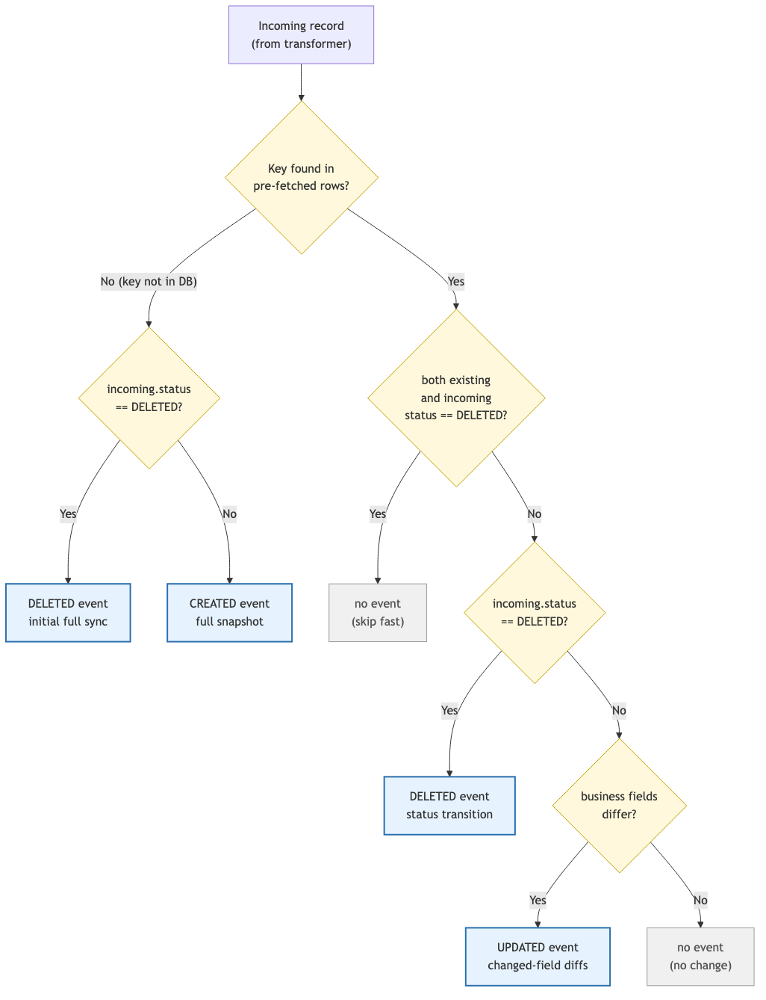

# Data Pipeline — CDC

## Overview

Phase 2 adds Change Data Capture (CDC) to the Data Pipeline's PostgreSQL sink. When enabled, the sink detects CREATED, UPDATED, and DELETED records during each batch write and inserts corresponding change events into the `event_outbox` table — atomically, within the same database transaction as the upserts.

The CDC logic is encapsulated in a dedicated `CDC` struct that the sink delegates to. When CDC is disabled (the default), the sink behaves exactly as in Phase 1 — no transaction wrapper, no pre-fetch, no outbox writes.

## Data Normalization

The Vusion API returns composite store IDs in the format `{retail_chain_id}.{store_id}` (e.g., `continente_pt.000010`). In Phase 1, these composites were stored as-is in the `store_id` column — redundant, since `retail_chain_id` is already a separate column.

In Phase 2, the connector strips the retail chain prefix at ingestion before building records. Only the store portion (`000010`) is persisted. The composite value is retained internally for VLink API URL paths (`/stores/{composite}/productLabelling/products`), which require it, but never leaves the connector layer.

Database migration **V1.0.0.15** performs a one-time fix-up:

- Strips the `{chain}.` prefix from existing `store_id` values in all entity tables (`stores`, `products`, `labels`, `access_points`) and in `event_outbox.entity_key`
- Adds `retail_chain_id` to `esl.store_sync_state` (previously keyed on `store_id` alone)

The `retail_chain_id` addition to `store_sync_state` prevents cross-chain collisions: with composite IDs stripped, two retail chains sharing the same store code (`000010`) would otherwise overwrite each other's sync timestamps. Sync state is now tracked per `(retail_chain_id, store_id)` pair.

## Feature Flag

CDC is gated behind a single configuration flag:

```yaml
sink:
  postgres:
    cdc:
      enabled: false   # default
```

When `cdc.enabled` is `false`, the sink dispatches batches through the original non-transactional path. When `true`, the sink wraps each batch in a transaction and delegates change detection and outbox writes to the CDC module.

The flag also gates the VLink connector's `deleted=true` query param: when CDC is on, list calls include soft-deleted rows so DELETED events can be emitted; when CDC is off, the param is omitted and deleted rows are skipped at the source. This keeps both ends consistent — there is no value in fetching deleted rows the sink would discard.

The flag is evaluated once at startup in the sink builder — the `CDC` struct is only instantiated when enabled. At runtime, the dispatch check is a nil pointer comparison (`s.cdc != nil`), not a config lookup.

## Architecture

All CDC logic lives in a single file (`internal/sink/postgres/cdc.go`) as an encapsulated struct with two public methods. The sink orchestrates the transaction and delegates each phase:

```
                         executeBatchWithCDC
                         ───────────────────
                                │
              ┌─────────────────┼──────────────────┐
              │            BEGIN (tx)               │
              │                 │                   │
              │    Phase 1: DetectChanges           │
              │    ├── groupByEntityType            │
              │    ├── buildFetchQuery (SELECT)     │
              │    ├── tx.Query (fetch existing)    │
              │    └── classifyAndDiff              │
              │                 │                   │
              │    Phase 2: Upsert                  │
              │    ├── buildUpsertBatch             │
              │    ├── tx.SendBatch                 │
              │    └── sendAndProcessBatch          │
              │                 │                   │
              │    Phase 3: WriteOutbox             │
              │    ├── buildOutboxInsert            │
              │    └── tx.Exec                      │
              │                 │                   │
              │            COMMIT                   │
              └─────────────────────────────────────┘
```

### CDC Struct

```go
type CDC struct {
    logger      *zap.Logger
    metrics     *telemetry.Metrics
    schema      commonpg.Schema
    outboxTable string
}
```

The struct carries the schema binding from `esl-common` and pre-computes the schema-qualified outbox identifier (e.g. `"esl"."event_outbox"`) once at construction, so every event INSERT carries an explicit `schema.table` reference rather than relying on `search_path` resolution. It exposes two methods:

- **`DetectChanges`** — fetches existing state within the transaction, classifies each record, and returns a slice of `event.ChangeEvent`
- **`WriteOutbox`** — inserts change events into the outbox within the same transaction

### Shared Helpers

Two functions were extracted from the original `executeBatch` to avoid duplication between the CDC and non-CDC paths:

| Helper | Purpose |
|---|---|
| `buildUpsertBatch` | Builds a `pgx.Batch` with upsert queries for all records |
| `sendAndProcessBatch` | Walks the batch results and returns per-record outcomes aligned with the input records, plus the classified trigger error |

Both paths call `sendAndProcessBatch` with the same signature. The non-CDC path additionally runs a per-record fallback after a batch failure (see [Error Handling](#error-handling)). The CDC path collapses any failure into uniform `rolledBackErr` outcomes after the rollback.

## Change Detection

### Step 1 — Group by Entity Type

Records in a batch may belong to different entity types (stores, products, labels, access points). The first step groups them using the `type` field from record metadata:

```go
type entityGroup struct {
    tableName    string
    conflictKeys []string
    records      []*models.Record
}
```

Conflict keys come from `entity.ConflictKeys` in esl-common — the single source of truth for entity business keys. Records whose entity type is not present in `entity.ConflictKeys` are silently skipped (no business key definition means CDC cannot build a meaningful event).

### Step 2 — Fetch Existing State

For each entity group, CDC builds a SELECT query that fetches the current row values for all records in the group:

```sql
SELECT "name"::TEXT, "price"::TEXT, "status"::TEXT, ...
FROM esl.products
WHERE ("retail_chain_id", "store_id", "item_id") IN (($1,$2,$3), ($4,$5,$6), ...)
```

Key aspects:

- **Explicit column list** — derived from the incoming record's `RawData` keys. No `SELECT *` — only columns being upserted are fetched, avoiding false diffs from database-only columns.
- **`::TEXT` casting** — all values are cast to TEXT to avoid Go type mismatches (e.g., `int32` vs `float64`, `time.Time` vs `string`). Both sides are normalised to strings for comparison. NUMERIC columns receive an additional decimal-canonicalization pass (see [Value normalisation](#value-normalisation) below) so that scale differences between the stored form and the source representation do not produce spurious diffs.
- **Single round-trip** — one batched SELECT per entity type, using a composite `IN` clause.

The query runs within the transaction. Under READ COMMITTED isolation (the PostgreSQL default), this is safe because the Data Pipeline is the sole writer to entity tables — no concurrent modifications can occur between the SELECT and the subsequent upsert.

### Step 3 — Classify and Diff



Each incoming record is compared against the pre-fetched existing state:

| Condition | Event | Payload |
|---|---|---|
| Existing and incoming both `status = "DELETED"` | No event (skip fast) | — |
| Incoming `status = "DELETED"` (transition or first-contact) | **DELETED** | Empty `{}` |
| Key not found in existing rows | **CREATED** | All non-key fields (full snapshot) |
| Key found, business fields differ | **UPDATED** | Only changed fields as `{"old": X, "new": Y}` diffs |
| Key found, all fields identical | No event | — |

#### Column handling

| Column category | Compared? | CREATED payload | UPDATED payload |
|---|---|---|---|
| Conflict keys (e.g., `store_id`) | No | No (in `entity_key`) | No (in `entity_key`) |
| Audit columns (`created_at`, `last_updated_at`) | No | Yes (flat value) | Yes (flat value, not diffed) |
| Business fields | Yes | Yes | Only changed fields |

Audit columns are excluded from comparison because they change on every upsert. However, they are included in the event payload: CREATED events carry both timestamps, and UPDATED events include `created_at` (from the existing row) and `last_updated_at` (from the incoming batch) as flat values — not as old/new diffs.

#### Value normalisation

Both sides (incoming `RawData` values and database TEXT values) are normalised to strings before comparison:

| Go type | Normalised form |
|---|---|
| `string` | As-is |
| `float64` | Formatted as number; trailing `.0` stripped for whole numbers |
| `bool` | `"true"` / `"false"` |
| `nil` | `"<nil>"` |
| `[]any` | Sorted, JSON-marshalled |
| Timestamps | Parsed and normalised (RFC3339, RFC3339Nano, and Postgres TEXT formats are all equivalent) |
| Postgres arrays | Parsed, sorted, and emitted as a canonical JSON array string (`["a","b"]`) — same form as the `[]any` row above, so a pristine slice in `RawData` compares equal to a `::TEXT`-cast array literal from the database |

This normalisation ensures that semantically equal values are never flagged as changes — for example, a Postgres TEXT timestamp `2024-10-04 08:31:38.879+00` matches an incoming RFC3339 value `2024-10-04T08:31:38.879Z`.

#### NUMERIC columns

NUMERIC columns require an extra step. The `::TEXT` cast preserves the column's declared scale (e.g., `8.00` for `NUMERIC(12,2)`), while the source value may arrive as a JSON number (`8` → Go `float64`) or a JSON string with a different scale (`"8.0"`). Without explicit handling, every record in every batch would emit an UPDATED event purely for scale or type formatting differences.

To avoid this, NUMERIC columns are declared per entity type and routed through a decimal-canonicalization pass that:

- Trims trailing zeros after the decimal point (`8.00` → `8`, `49.90` → `49.9`)
- Removes an empty fractional part (`8.` → `8`)
- Collapses negative zero (`-0` → `0`)
- Accepts equivalent inputs across `float64`, `int`, `int64`, JSON numbers, and decimal-formatted strings

So `8.00` (DB), `8` (JSON number), and `"8.0"` (JSON string) all reduce to the same canonical form and compare equal. The declaration is verified at sink startup against the live `information_schema`: a warning is logged if a declared column is missing from the schema, or if the schema contains a NUMERIC column not declared in the registry.

This handling is applied only to declared columns. String columns whose values happen to look numeric (e.g., zero-padded codes such as `"009648"`) are not affected, so legitimate value differences in non-NUMERIC columns continue to surface as UPDATED events.

#### Payload value normalisation

Values included in event payloads go through a separate normalisation step (`normalizePayloadValue`) that converts strings sourced from `::TEXT`-cast columns back to native Go types before JSON-marshalling:

- **Timestamps** become `time.Time` and serialise as RFC3339Nano, so an outbox payload sees the same timestamp shape regardless of whether the value came from pristine `RawData` (incoming JSON) or from a database fetch (Postgres TEXT format).
- **Postgres array literals** become `[]any` and serialise as proper JSON arrays (`["a","b"]`) — required because UPDATE event payloads carry an `old` value sourced from the database (PG literal) alongside a `new` value sourced from pristine `RawData` (real Go slice). Without this normalisation, `old` would round-trip into JSONB as a quoted string while `new` would be a real array.

This keeps the JSONB payload shape uniform across CREATED and UPDATED events.

## Outbox Write

If any changes were detected, CDC builds a single multi-row INSERT:

```sql
INSERT INTO event_outbox (event_type, entity_type, entity_key, payload, occurred_at)
VALUES ($1,$2,$3,$4,$5), ($6,$7,$8,$9,$10), ...
```

The `entity_key` and `payload` fields are JSON-marshalled before insertion. The `occurred_at` timestamp is the batch timestamp — a deterministic value set once per batch and injected into all records, ensuring the outbox event and the upserted row share the same audit timestamp.

The `id` (UUID), `status` (`PENDING`), and `delivered_at` (`NULL`) columns use their database defaults.

## Transaction Flow

The complete CDC batch execution:

```
BEGIN (READ COMMITTED)
│
├── Phase 1: DetectChanges
│   ├── SELECT existing rows (1 query per entity type)
│   └── Classify: CREATED / UPDATED / unchanged
│
├── Phase 2: Upsert
│   ├── Build pgx.Batch (1 upsert per record)
│   ├── tx.SendBatch → process results (fail-fast)
│   └── On error: ROLLBACK, return failure
│
├── Phase 3: WriteOutbox (only if changes detected)
│   ├── INSERT INTO event_outbox (multi-row)
│   └── On error: ROLLBACK, return failure
│
└── COMMIT
```

The transaction guarantees atomicity — if any phase fails, all upserts and outbox writes are rolled back. A record is never persisted without its corresponding change event, and a change event is never written without its corresponding data change.

### Single-writer assumption

The pipeline uses READ COMMITTED isolation (PostgreSQL default). This is safe because the Data Pipeline is the sole writer to entity tables. No concurrent modifications can occur between the SELECT (Phase 1) and the upsert (Phase 2), so the pre-fetched state is always current.

If another service starts writing to entity tables in the future, this assumption must be revisited — SERIALIZABLE isolation or explicit row-level locking would be needed to prevent missed diffs.

## Performance

### Network round-trips

| Path | Round-trips | Description |
|---|---|---|
| Non-CDC | 1 | `pool.SendBatch` (auto-commit) |
| CDC | 4–5 | BEGIN → SELECT → upsert batch → outbox INSERT → COMMIT |

The CDC path adds 3–4 round-trips. On a LAN connection, this translates to approximately 0.1ms per additional round-trip. An earlier design combined SELECT and upserts into a single `SendBatch` call to save one round-trip, but this was dropped — the coupling violated single responsibility and saved only ~0.1ms, not worth the complexity.

### Measured overhead

Benchmarks against a real PostgreSQL container (batch sizes 10–500):

| Scenario | Overhead vs non-CDC |
|---|---|
| All unchanged (best case) | ~30% — SELECT only, no outbox write |
| Mixed (10% changed) | ~50% |
| All new (worst case) | ~100% — every record produces a CREATED event |

At `batch_size=500` (the production default), the worst case adds approximately 4 seconds to a full 240k-record sync. This is acceptable for the current workload profile.

If CDC overhead becomes a bottleneck, the following optimisations are available:
- Lower batch size to 200–300 (reduces per-batch transaction scope)
- Chunk outbox INSERTs for very large batches
- Switch to COPY for bulk outbox loading

## Error Handling

### Per-record outcome reporting

The sink reports the persistence outcome of each record back to the pipeline via an `OutcomeHandler` callback installed on the sink at startup:

```go
type OutcomeHandler func(record *models.Record, err error)

type Sink interface {
    Write(ctx context.Context, record *models.Record) error
    Close() error
    SetOutcomeHandler(h OutcomeHandler)
    SetRunID(runID int64)
}
```

The contract: sinks must invoke the handler exactly once per record before `Close` returns, with `err == nil` on successful persistence and a non-nil error on permanent failure. The handler is the canonical mechanism for the connector and metrics layer to learn what actually persisted (vs. what was merely emitted to the sink channel).

### pgx batch transactional model

`pool.SendBatch` runs all queued queries in an implicit transaction: PostgreSQL aborts the transaction on any error and rolls back even queries that `br.Exec` reported as successful. This means the per-record `Exec` results are not the source of truth on failure — the only safe interpretation of a failed batch is "all records rolled back, none persisted".

The non-CDC and CDC paths handle this divergence differently because their atomicity contracts differ.

### Non-CDC path: per-record fallback

When `executeBatch` runs against the pool and the batch fails, every record is re-executed individually via `pool.Exec`. Each runs in its own implicit transaction and gets its true outcome:

- Records with valid data persist on the second attempt.
- The genuine violator(s) fail with their real PG error, classified by the existing error machinery.
- Outcomes are then dispatched per-record to the `OutcomeHandler`.

The fallback's overhead is bounded: it only triggers after a batch failure, only for the failed batch, and the happy path stays fully pipelined. Records past the trigger no longer carry the cached pgx cascade error in their outcomes — each record's outcome reflects whether it actually persisted.

### CDC path: uniform rolledBackErr

`executeBatchWithCDC` wraps the batch, change detection, and outbox writes in a single explicit transaction. Per-record retries outside this transaction would break the upsert/outbox atomicity contract, so the CDC path does not run the fallback. Instead:

- Commit succeeds → every record's outcome is `nil`.
- Anything fails (`DetectChanges`, batch upsert, `WriteOutbox`, or commit itself) → every record's outcome carries `rolledBackErr`, which wraps the underlying root cause via `%w`. Downstream callers can use `errors.As` to recover the original `*pgconn.PgError` for classification.

The `rolledBackErr` synthesises a uniform per-record error from a single source of truth (the commit result), avoiding the need to interpret poisoned `br.Exec` results.

### Outcome-driven store completion

The pipeline tracks a per-store **pending** counter to detect ack leaks and to drive store-level status classification. The flow:

- `RecordEmitted(storeID)` is called after every record successfully enters the sink-bound channel and increments the store's pending counter.
- `RecordPersisted(record, err)` is the body of the OutcomeHandler. It decrements pending, increments either the per-store persisted counter (on success) or the per-store persistence-failure counter (on failure), and notifies the Phase 1 store gate when the record is store-typed.
- `MarkStoreStreamingDone(storeID)` is called when Phase 2 finishes streaming records for a store (`processStoreEntities` returns nil).

A store reaches the **success** branch only when streaming finished AND every emitted record was acked. A non-zero pending counter after `sink.Close` always signals a code defect — either a pipeline-side drop site that forgot to report or a sink that violated the OutcomeHandler contract — and surfaces as `failed: ack leak: N records unaccounted for` in the per-store run.

The Phase 1 store gate is now metrics-driven. The connector emits N store records, then calls `WaitForStoreRecords(ctx, N)`, which blocks until N store-typed records have been reported via `RecordPersisted`. `Record.Ack` is gone; one shared OutcomeHandler installed by the pipeline builder is the only mechanism.

### Per-store status resolution

`failureStatusResolver` walks four signals in priority order:

1. Connector-side error (e.g. failed Vusion API fetch) → `failed` with the connector error message.
2. Sink-side persistence error (first message wins per store) → `failed` with `"persistence: <msg>"`.
3. Streaming never finished → `cancelled: another store failed`.
4. Streaming finished but pending != 0 → `failed: ack leak: N records unaccounted for`.

Otherwise the store is `success`. The same resolver is used on both the success and failure pipeline-run paths so a store with persistence failures cannot masquerade as `success` even when the global pipeline finished cleanly.

### `*_processed` columns: persisted, not emitted

`StoreSyncRun.{Products,Labels,AccessPoints}Processed` now reflects records that **actually persisted** in the destination, not records emitted to the sink channel. The previous "emitted" semantics conflated successful enqueue with successful write — a store with constraint-violating labels would report `labels_processed = 427` while only ~80 rows landed in the labels table. The honest count comes from `GetStorePersistedMetrics`, populated by the OutcomeHandler.

### Records-with-errors accuracy

Only records that genuinely fail contribute to the `records_with_errors` table. Specifically:

- **Non-CDC**: only the records whose individual fallback `pool.Exec` fails are inserted. The cascade no longer produces false positives for records past the trigger.
- **CDC**: only the trigger record (or the genuine source of failure, e.g. an `DetectChanges` query error) is inserted, since the rollback prevents any record from being persisted.

### Records-with-errors correlation

Each row inserted into `records_with_errors` carries five correlation columns that pin the failure to a specific run, store, and pipeline:

| Column | Source |
|---|---|
| `run_id` | Sink's runID field, populated via `SetRunID(int64)` at run start (after `InsertRun` returns) |
| `retail_chain_id` | `record.RawData["retail_chain_id"]` — the post-normalizer field name |
| `store_id` | `record.RawData["store_id"]` — the **stripped** form, matching `products.store_id`. The `{retail_chain}.{store}` composite returned by Vusion is stripped at the connector boundary and never reaches the sink |
| `pipeline_name` | Sink's pipelineName field, set once via `WithPipelineName(name)` on the sink builder |
| `entity_type` | `record.Metadata["type"]` (`store`, `product`, `label`, `accesspoint`) |

**`SetRunID` is a setter, not a constructor parameter or context value.** A setter keeps the sink reusable across runs (no per-run rebuild), keeps the dependency explicit at the call site (no `ctx.Value` lookups), and is trivial to mock in tests. The trade is that callers must remember to invoke it; missing the call is non-fatal — `run_id` ends up NULL via `NULLIF($n, 0)`, and downstream queries already need to handle NULL for backward compatibility with pre-PR-3 rows.

`pipeline_name` follows a different shape because it doesn't change between runs: it's set on the sink builder via `WithPipelineName(name)` and stays put for the sink's lifetime. Same NULL-tolerant treatment applies if the builder option is omitted.

Typical correlation queries:

```sql
-- All failed records for one run, grouped by store
SELECT retail_chain_id, store_id, entity_type, COUNT(*)
  FROM esl.records_with_errors
 WHERE run_id = $1
 GROUP BY retail_chain_id, store_id, entity_type;

-- Recent failed records for a specific store (across runs)
SELECT run_id, created_at, error_message
  FROM esl.records_with_errors
 WHERE retail_chain_id = $1 AND store_id = $2
 ORDER BY id DESC LIMIT 50;
```

### Error classification

The same error classification from Phase 1 applies:

| Type | Action |
|---|---|
| **Transient** (deadlock, serialisation, system errors) | Retried with exponential backoff |
| **Permanent** (constraint violations, syntax errors) | Stored in `records_with_errors`, not retried |

## Observability

### Metrics

| Metric | Type | Description |
|---|---|---|
| `sink.cdc.events` (attribute: `event_type=CREATED`) | Counter | Number of CREATED events detected |
| `sink.cdc.events` (attribute: `event_type=UPDATED`) | Counter | Number of UPDATED events detected |
| `sink.cdc.events` (attribute: `event_type=DELETED`) | Counter | Number of DELETED events detected |
| `sink.cdc.detect_duration_ms` | Histogram | Time spent in change detection (SELECT + classify) |
| `sink.cdc.outbox_duration_ms` | Histogram | Time spent writing to the outbox |

All metrics include the `sink.type=postgres` attribute and are prefixed with `eslorchestrator.` in the OTel exporter.

### Logging

**Change detection** (INFO level):

```json
{
  "msg": "CDC change detection completed",
  "batch_size": 100,
  "cdc_created": 3,
  "cdc_updated": 7,
  "cdc_deleted": 2,
  "cdc_unchanged": 88,
  "cdc_fetch_ms": 12
}
```

**Outbox write** (DEBUG level):

```json
{
  "msg": "CDC outbox write",
  "event_count": 10,
  "cdc_outbox_ms": 2
}
```

## Configuration Reference

CDC adds a single configuration block under `sink.postgres`:

```yaml
sink:
  postgres:
    # ... existing connection and batching settings ...

    cdc:
      enabled: true   # Enable CDC change detection and outbox writes
```

No additional CDC-specific settings are needed. The outbox table must exist in the database (see [Database](03-database.md) migrations V1.0.0.16–18).

## Deletion Detection

### Scope

DELETED event detection applies to **products and labels only**. Stores and access points have no deletion lifecycle in Vusion.

### VLink `deleted=true`

The VLink client always passes `deleted=true` on all product and label endpoints. This is an additive toggle — the response includes both ACTIVE and DELETED rows in a single paginated walk. No separate endpoint or second request is needed.

### Detection signal

The canonical detection signal is `status == "DELETED"`. This works for both products and labels. `deletionDate` from Vusion is stored as informational metadata but is not used for detection — it is unreliable for labels (observed NULL on confirmed-DELETED rows).

### Soft-delete storage

Records are soft-deleted via dual timestamps following the existing audit convention:

| Column | Source | Description |
|---|---|---|
| `deletion_date` | Vusion `deletionDate` field | Business timestamp — when Vusion marked the record deleted. Reliable for products; informational for labels (may be NULL) |
| `deleted_at` | Pipeline batch timestamp | Audit timestamp — when the pipeline first detected the deletion. Set by `injectAuditTimestamps` regardless of CDC on/off. Preserved on subsequent upserts via `COALESCE(existing, new)` |

The record stays in the database with all fields intact. No hard `DELETE` SQL is issued.

### Audit timestamp (`deleted_at`) behaviour

`deleted_at` is injected by `injectAuditTimestamps` — the same function that sets `created_at` and `last_updated_at` on every record. When a record has `status == "DELETED"`, `deleted_at` is set to the batch timestamp. This works identically with CDC enabled or disabled.

On upsert conflict, the SQL uses `COALESCE(existing.deleted_at, EXCLUDED.deleted_at)` — the first-detection timestamp is preserved; subsequent syncs of the same deleted record do not overwrite it.

### Classification edge cases

| Scenario | Behaviour |
|---|---|
| ACTIVE → DELETED | Emit DELETED event (empty payload) |
| DELETED → DELETED | No event (skip fast) |
| DELETED → ACTIVE (theoretical undelete) | Treated as regular UPDATED — no special event type |
| Key not in DB + incoming DELETED | Emit single DELETED event (initial full sync) |

## Known Limitations

- **Labels `deletion_date` may be NULL on confirmed-DELETED rows.** Vusion populates the `deletionDate` field unreliably for labels (observed NULL on rows whose `status` is `DELETED`). The pipeline stores `deletion_date` when provided and leaves it NULL otherwise; it never uses `deletion_date` as a detection signal. `status == "DELETED"` is the canonical classifier, and `deleted_at` (audit timestamp) is always set when the deletion is detected. Consumers that need a reliable deletion timestamp should read `deleted_at`.
