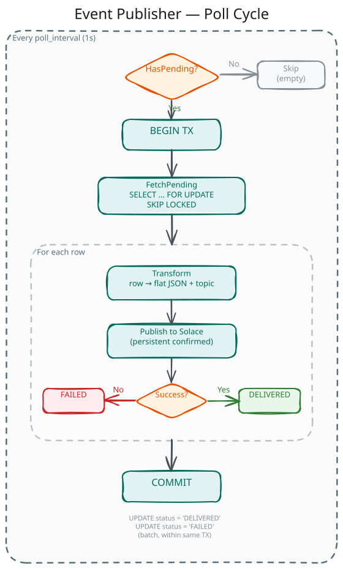

# Event Publisher

## Overview

The Event Publisher is a long-running Go service that polls the `event_outbox` table for pending CDC events and publishes them to a Solace message broker. It runs as a Kubernetes Deployment, decoupled from the Data Pipeline CronJob.

The service follows a simple loop: poll → transform → publish → mark delivered. Each cycle runs within a single database transaction, using `SELECT FOR UPDATE SKIP LOCKED` for row-level locking. Events are published with persistent confirmed delivery, providing at-least-once guarantees.



## Technology Stack

| Technology | Purpose |
|---|---|
| Go 1.26 | Application language |
| pgx/v5 via esl-common | PostgreSQL driver with connection pooling |
| go-solace-sdk | Solace client library (wraps `solace.dev/go/messaging`) |
| Viper | YAML configuration with environment variable overrides |
| Zap | Structured JSON logging |
| OpenTelemetry | Metrics (application + SDK-level) |

## Architecture

The service is organised into five internal packages:

| Package | Responsibility |
|---|---|
| `relay` | Core polling loop, batch processing, transaction management |
| `outbox` | PostgreSQL repository — fetch pending, mark delivered/failed |
| `transform` | Outbox row → flat JSON payload + dynamic Solace topic |
| `messaging/solace` | Solace client wrapper — connect, publish confirmed, disconnect |
| `health` | HTTP liveness and readiness probe server |

```
            ┌──────────────────────────────────────────┐
            │              Event Publisher              │
            │                                          │
            │  ┌────────────────────────────────────┐  │
      ┌─────┼──│  Relay (poll loop)                 │  │
      │     │  │  ┌─────────┐  ┌───────────┐       │  │
      │     │  │  │ Outbox  │  │ Transform │       │  │
      │     │  │  │  Repo   │  │           │       │  │
      │     │  │  └────┬────┘  └─────┬─────┘       │  │
      │     │  └───────┼─────────────┼─────────────┘  │
      │     │          │             │                 │
      │     │  ┌───────┴───┐  ┌─────┴──────────┐     │
      │     │  │ PostgreSQL │  │ Solace Client  │──────┼──→ Solace Broker
      │     │  │   (pgx)   │  │ (go-solace-sdk)│     │
      │     │  └───────────┘  └────────────────┘     │
      │     │                                          │
      │     │  ┌──────────────┐                       │
      │     │  │ Health Server │ ← K8s probes          │
      │     │  └──────────────┘                       │
      │     └──────────────────────────────────────────┘
      │
      ▼
  PostgreSQL
  event_outbox
```

## Polling Loop

The relay runs a ticker-based loop at a configurable interval (default: 1 second). Each cycle:

### 1. Check for pending events

A cheap `SELECT EXISTS` query determines whether any `PENDING` rows exist. If the outbox is empty, the cycle ends without opening a transaction.

### 2. Fetch and lock rows

```sql
SELECT id, event_type, entity_type, entity_key, payload, status, occurred_at, delivered_at
FROM event_outbox
WHERE status = 'PENDING'
ORDER BY occurred_at
LIMIT $1
FOR UPDATE SKIP LOCKED
```

`FOR UPDATE SKIP LOCKED` acquires row-level locks without blocking. Rows already locked by another transaction are skipped, which naturally supports horizontal scaling — multiple publisher replicas can process distinct rows concurrently without coordination.

### 3. Process each row

For each fetched row:

1. **Transform** — Convert the outbox row into a flat JSON payload and a dynamic Solace topic (see [Event Transformation](#event-transformation))
2. **Publish** — Send to Solace with persistent confirmed delivery
3. **Track outcome** — Collect the row ID into a delivered or failed list

Processing continues even if individual rows fail. Transform errors (unsupported entity type, malformed store ID) and publish errors (Solace unreachable, confirmation timeout) both result in the row being marked as `FAILED`, but do not affect other rows in the batch.

### 4. Mark outcomes

Two batch updates within the same transaction:

```sql
UPDATE event_outbox SET status = 'DELIVERED', delivered_at = $1 WHERE id = ANY($2)
UPDATE event_outbox SET status = 'FAILED' WHERE id = ANY($3)
```

### 5. Commit

The entire cycle — fetch, status updates — commits atomically. If the transaction fails, all status changes are rolled back and rows return to `PENDING` for the next cycle.

## Event Transformation

The transform step converts an outbox `ChangeEvent` into a flat JSON payload and a Solace topic. The Event Publisher does not send raw outbox rows — it restructures the data for downstream consumers.

### Payload assembly

1. **Start with entity key fields** — `retail_chain_id`, `store_id` (split — see below), and any additional conflict keys (`item_id`, `label_id`, `id`)
2. **Merge payload fields** — For CREATED events, the payload is already flat. For UPDATED events, diff objects `{"old": X, "new": Y}` are flattened to extract only the `"new"` value. Audit columns (`created_at`, `last_updated_at`) pass through as-is (they are already flat values, not diffs).
3. **Add metadata** — `eventId` (the outbox row UUID) and `send_date` (current time in RFC3339)

The result is a flat JSON object regardless of event type. Downstream consumers distinguish between creation and update events via the Solace topic, not the payload structure.

### Store ID splitting

The outbox stores composite store IDs in the format `{retail_chain_id}.{store_id}` (e.g., `continente_pt.000010`). The transform step splits on the dot and extracts only the store portion (`000010`) for both the published payload and the topic.

### Example published event

```json
{
  "eventId": "a0eebc99-9c0b-4ef8-bb6d-6bb9bd380a11",
  "retail_chain_id": "continente_pt",
  "store_id": "000010",
  "store_name": "Loja Alpha",
  "creation_date": "2026-03-01T10:00:00Z",
  "modification_date": "2026-04-06T14:30:00Z",
  "created_at": "2026-03-01T10:00:00Z",
  "last_updated_at": "2026-04-06T14:30:00Z",
  "send_date": "2026-04-09T12:00:00Z"
}
```

## Solace Publishing

### Topic structure

Topics follow a hierarchical pattern:

```
in-store/orchestratoresl/{entitySegment}/{messageType}/v1/{insignia}/{storeId}
```

| Variable | Source |
|---|---|
| `{entitySegment}` | Static mapping from entity type (see table below) |
| `{messageType}` | Event type lowercased: `created`, `updated` |
| `{insignia}` | `retail_chain_id` from `entity_key` |
| `{storeId}` | `store_id` from `entity_key` (split, store portion only) |

**Entity type to topic segment mapping:**

| Entity type | Topic segment |
|---|---|
| `store` | `stores/store` |
| `product` | `products/product` |
| `label` | `labels/label` |
| `accesspoint` | `accesspoints/accesspoint` |

**Example topics:**

```
in-store/orchestratoresl/stores/store/created/v1/continente_pt/000010
in-store/orchestratoresl/products/product/updated/v1/continente_pt/000010
in-store/orchestratoresl/labels/label/created/v1/continente_pt/000010
in-store/orchestratoresl/accesspoints/accesspoint/updated/v1/continente_pt/000010
```

### Delivery mode

Events are published using **persistent confirmed delivery** (`PublishMessageConfirmed`). The Solace broker acknowledges receipt before the publisher considers the message delivered. This prevents data loss during broker-to-consumer distribution.

The go-solace-sdk handles publish retries internally (3 attempts, exponential backoff). If all attempts fail or the confirmation timeout is exceeded, the Event Publisher marks the outbox row as `FAILED`.

## Health Endpoints

The service exposes HTTP endpoints for Kubernetes probes:

| Endpoint | Probe | Behaviour |
|---|---|---|
| `/health` | Liveness | Always returns `200 OK` if the process is running |
| `/ready` | Readiness | Returns `200 OK` if both PostgreSQL and Solace are connected; `503 Service Unavailable` otherwise |

The readiness check pings the database pool and verifies the Solace client's connection status. If either dependency is down, the service reports not ready and Kubernetes stops routing traffic to it.

Port and paths are configurable via `health.port`, `health.health_path`, and `health.ready_path`.

## Graceful Shutdown

On `SIGINT` or `SIGTERM`:

1. Stop accepting new poll cycles
2. Finish the current batch (publish remaining events, update statuses, commit)
3. Shut down the health HTTP server
4. Disconnect the Solace client
5. Close the database pool

A configurable shutdown timeout (`publisher.shutdown_timeout`, default: 30 seconds) bounds the entire sequence. If exceeded, the process force-exits.

## Configuration Reference

The service is configured via a YAML file with environment variable overrides. Environment variables use uppercase underscore notation (e.g., `DATABASE_HOST`, `SOLACE_TOPIC_PREFIX`).

### Database

```yaml
database:
  host: localhost
  port: 5432
  user: esl
  password: ""
  database: eslorchestrator
  schema: esl                        # Sets search_path at pool level
  ssl_mode: disable
  application_name: "event-publisher"
  max_conns: 4
  min_conns: 1
  max_conn_lifetime: "1h"
  max_conn_idle_time: "30m"
  health_check_period: "1m"
  connect_timeout: "5s"
```

All fields map directly to esl-common's `postgres.PoolConfig`.

### Solace

```yaml
solace:
  host: tcp://localhost:55555         # tcp:// or tcps:// for TLS
  vpn: default                        # Message VPN name
  username: admin
  password: admin
  topic_prefix: "in-store/orchestratoresl"
  connect_timeout: "10s"              # TCP connection timeout (min: 1s)
  connect_retries: 3                  # TCP connect retry attempts
  reconnect_retries: 3                # Post-disconnect reconnection attempts (-1 = infinite)
  reconnect_wait: "2s"                # Delay between reconnect attempts (min: 100ms)
  keep_alive: "30s"                   # TCP keep-alive interval
  confirmation_timeout: "10s"         # Publish confirmation timeout
```

### Publisher

```yaml
publisher:
  poll_interval: "1s"                 # Outbox polling frequency
  batch_size: 100                     # Max events per poll cycle
  shutdown_timeout: "30s"             # Max time to finish batch on shutdown
```

### Health

```yaml
health:
  port: 8081
  health_path: "/health"
  ready_path: "/ready"
```

### Logging

```yaml
log:
  level: info                         # debug, info, warn, error
```

## Observability

### Application metrics

| Metric | Type | Attributes | Description |
|---|---|---|---|
| `event_publisher.events_processed_total` | Counter | `entity_type`, `event_type`, `status` | Events processed, segmented by outcome |
| `event_publisher.poll_batch_size` | Histogram | — | Events fetched per poll cycle |
| `event_publisher.poll_cycles_total` | Counter | — | Total poll cycles (including empty) |

The `status` attribute on `events_processed_total` distinguishes between `delivered` and `failed` outcomes, enabling alerting on failure rates per entity type.

### SDK metrics

The go-solace-sdk automatically records its own metrics when a `MeterProvider` is supplied:

- `solace.core.*` — Connection pool and transport metrics
- `solace.producer.*` — Publish confirmation counts, latency, retries, and payload size

### Logging

All log entries use Zap structured JSON. Key log events:

| Level | Event | Fields |
|---|---|---|
| INFO | Poll cycle completed | `batch_size`, `delivered`, `failed` |
| INFO | Startup / shutdown | Component states |
| WARN | Publish failure | `event_id`, `entity_type`, `error` |
| WARN | Transform failure | `event_id`, `entity_type`, `error` |
| ERROR | Transaction failure | `error` |
| DEBUG | Individual event processed | `event_id`, `topic`, `status` |

The go-solace-sdk logs are bridged through Zap via a `zapslog.NewHandler` adapter, consolidating all output into a single structured format.

## Delivery Guarantees

The Event Publisher provides **at-least-once delivery**:

1. Events are published to Solace **before** the database status is updated
2. If the process crashes between publishing and committing, the outbox row stays `PENDING`
3. On restart, the row is polled again and re-published

Consumers must deduplicate using the `eventId` field in each published event. This is the outbox row's UUID primary key — deterministic across retries. The duplication window is bounded by the batch size (default: 100 events) and only occurs during crash recovery, not during normal operation.

## Key Design Decisions

### Polling over WAL logical replication

The Event Publisher polls the outbox table rather than consuming PostgreSQL's WAL (Write-Ahead Log) via logical replication. Both approaches were evaluated:

| Concern | Polling | WAL streaming |
|---|---|---|
| **Operational complexity** | Low — standard SQL queries | High — requires `wal_level=logical`, replication slots, WAL retention management |
| **Latency** | Configurable (default 1s) | Near real-time (sub-second) |
| **Observability** | Free via `status` column — `GROUP BY status` shows outbox health | Requires external monitoring of replication lag and slot state |
| **WAL bloat risk** | None | Inactive slot holds WAL indefinitely, risking disk exhaustion |
| **Failure handling** | Explicit `FAILED` status in database | Complex — failed messages need a dead-letter mechanism |
| **Scaling** | `FOR UPDATE SKIP LOCKED` supports multiple replicas | Requires partitioned replication or a single consumer |

Polling was chosen because the 1-second latency is sufficient for the ESL use case, operational simplicity is a priority (no DBA involvement for replication slots), and the explicit `status` column provides built-in observability. WAL streaming would be the better choice for high-throughput or sub-second latency requirements.

### Transaction-scoped publishing

The entire poll cycle — fetch, publish, mark — runs within a single database transaction. Rows stay locked during Solace publishing. This is acceptable because:

- The Data Pipeline only INSERTs into the outbox (no conflict with row locks)
- Batch size is capped (100 events)
- A single publisher instance is expected in the initial deployment

### No application-level retry for failed events

Events that fail to transform or publish are marked `FAILED` immediately — there is no automatic retry. The go-solace-sdk handles low-level publish retries internally (3 attempts, exponential backoff), but if the SDK exhausts its retries, the event is considered failed.

This design keeps the publisher stateless and simple. Failed events remain in the outbox for investigation. Replay or retry is handled externally (e.g., resetting status to `PENDING` after fixing the root cause).

## Known Limitations

### No per-entity ordering guarantee

With a single publisher replica, events for the same entity are published in `occurred_at` order. With multiple replicas, `FOR UPDATE SKIP LOCKED` distributes rows across replicas without entity-key affinity — two events for the same entity could be processed by different replicas and arrive out of order. If downstream consumers require per-entity ordering, partitioning by entity key (e.g., consistent hashing) would be needed.

### Failed events require manual intervention

Events marked `FAILED` stay in the outbox indefinitely. There is no dead-letter queue or automatic retry mechanism. Recovery requires identifying the root cause and resetting the status to `PENDING` manually or via an operational script.
