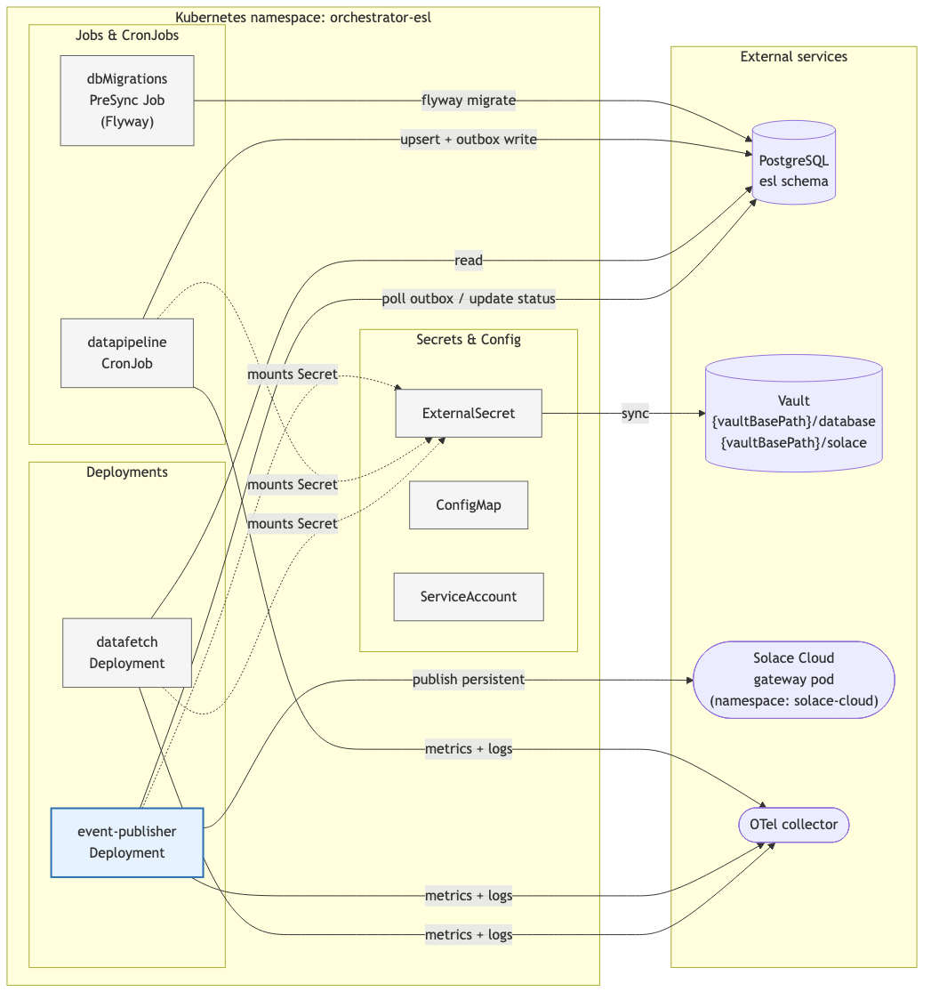
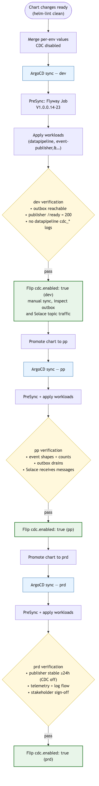

# Deployment & Infrastructure

## Overview

Phase 2 adds one new component (event-publisher) and updates one existing component (datapipeline). All are deployed via the existing single Argo CD Application managed by the ESL Orchestrator Helm chart — no new cluster-level resources or separate pipelines.

The rollout has two goals: (1) chart changes can land safely with CDC disabled, and (2) entity tables are populated by at least one full sync *before* CDC is enabled, so that the first CDC run does not flood Solace with a CREATED event per active row plus a DELETED event per historical DELETED row VLink returns. The CDC flag is flipped per environment only after both conditions are met.

## Component Inventory

| Component | Workload | Lifecycle | Phase 1 | Phase 2 |
|---|---|---|---|---|
| dbMigrations | Flyway Job (PreSync hook) | One-shot per sync | Existing | New migrations V1.0.0.14–24 (V1.0.0.15 strip composite `store_id` + add `retail_chain_id`; V1.0.0.16–18 `event_outbox` table, indexes, retention function; V1.0.0.19 deletion columns; V1.0.0.20 entity ID length widening; V1.0.0.21 reset role-level `statement_timeout`; V1.0.0.22 `records_with_errors` correlation columns; V1.0.0.23 drop `UNIQUE` qualifier on access-points indexes; V1.0.0.24 partition sync-state retention triggers by `sync_status`) |
| datapipeline | CronJob | Scheduled (daily default) | Existing | Added CDC logic + `cdc.enabled` flag |
| datafetch | Deployment + Service + Ingress | Always-on | Existing | Unchanged |
| **event-publisher** | Deployment | Always-on | — | **New** |

## Prerequisites

Before deploying Phase 2, the following must be in place:

### 1. Vault entries

- `{vaultBasePath}/database` — existing (Phase 1), no changes
- **New:** `{vaultBasePath}/solace/oauth` with two properties (OAuth2 client credentials):
  - `client-id` — OAuth2 client ID issued by the IdP
  - `client-secret` — OAuth2 client secret

The remaining Solace config (`host`, `vpn`, `token_endpoint`, `scope`, `topic_prefix`) is non-sensitive and lives in the per-env values file (`eventPublisher.config.solace.*`). `auth_scheme` is hardcoded to `oauth2` in the ConfigMap — basic auth is only used in local docker-compose and is not wired into the chart.

The event-publisher's ExternalSecret references both `{vaultBasePath}/database` (reuses the same credentials as datapipeline) and `{vaultBasePath}/solace/oauth`. Missing entries cause the ExternalSecret reconcile to fail and block pod startup.

### 2. Solace Cloud gateway in cluster

The event-publisher's network policy targets `namespace: solace-cloud`, `app: solace`, port `55443`. Confirm this gateway pod exists in the target cluster before applying the chart — its absence silently blocks egress (the publisher will start but fail readiness).

### 3. Database migration compatibility

V1.0.0.15 performs a one-time, idempotent fix-up: strips composite `{retail_chain_id}.{store_id}` prefixes from all `store_id` columns and adds `retail_chain_id` to `store_sync_state`. Safe to re-run. See [03-database.md](03-database.md) for migration details.

### 4. Image built and pushed

The event-publisher image must be built and pushed to `ghcr.io/sonaemc-instore/lac1041-instoreorchestrator_esl-eventpublisher-application` before setting `eventPublisher.imageTag` in the per-env values file.

## Rollout Sequence

Zero-downtime rollout in three gated steps.

### Step 1 — ArgoCD sync with CDC disabled

1. Merge the chart update with `dataPipeline.config.cdc.enabled: false` (the default) in the per-env values file
2. ArgoCD picks up the change and executes the PreSync phase first: Flyway runs the new migrations, including V1.0.0.15
3. ArgoCD then applies the regular resources: datapipeline CronJob ConfigMap is updated, event-publisher Deployment is created
4. The event-publisher starts, polls the outbox (empty) and idles at the configured `poll_interval`
5. The next scheduled datapipeline run uses the updated image; with `cdc.enabled: false`, the sink behaves as in Phase 1 — no transaction wrapper, no outbox writes

Outcome: all infrastructure is in place, no change events are produced, no risk of incorrect publishing during migration.

### Step 2 — Verify readiness

```sh
# Event publisher pod is running and ready
kubectl get pods -l app=orchestrator-esl-eventpublisher

# Readiness probe passes (reports DB + Solace connectivity)
kubectl exec -it deploy/orchestrator-esl-eventpublisher -- curl -sf http://localhost:8081/ready

# Outbox table exists and is empty
psql "$DB_URL" -c "SELECT COUNT(*), status FROM esl.event_outbox GROUP BY status"

# Latest datapipeline run completed cleanly with CDC disabled (no cdc_* log fields)
kubectl logs -l app=orchestrator-esl-datapipeline --tail=500 | grep -i cdc || echo "CDC not active — expected"
```

### Step 3 — Enable CDC

1. Edit `values-{env}.yaml`, set `dataPipeline.config.cdc.enabled: true`
2. Commit, push, and let ArgoCD sync the ConfigMap change
3. Next datapipeline run produces change events into the outbox
4. Event-publisher drains the outbox on each poll cycle

### Step 4 — Verify event flow

```sh
# Outbox shows DELIVERED rows
psql "$DB_URL" -c "SELECT status, COUNT(*) FROM esl.event_outbox GROUP BY status"

# Event publisher metrics show non-zero delivered events
kubectl exec -it deploy/orchestrator-esl-eventpublisher -- \
  curl -s http://localhost:8081/metrics | grep event_publisher_events_processed
```

Spot-check Solace topic subscription via the Solace Cloud portal or a test consumer. Expect traffic on `.../created/v1/...`, `.../updated/v1/...`, and `.../deleted/v1/...` topic segments — a first-contact sync will surface historical DELETED rows on the `deleted` topics (see [04-datapipeline.md](04-datapipeline.md) and [07-operations.md](07-operations.md)).

## Rollback

### Pause event publishing (keep outbox intact)

1. Set `dataPipeline.config.cdc.enabled: false` in the env's values file and push
2. ArgoCD syncs — next datapipeline run produces no new events
3. event-publisher drains any remaining PENDING rows, then idles
4. No database rollback needed — V1.0.0.15 is data-only and the `event_outbox` table is always safe to leave in place

### Fully remove event-publisher

1. Remove (or comment out) the eventPublisher section in per-env values
2. `helm upgrade` or ArgoCD sync — the SA, ExternalSecret, ConfigMap, and Deployment are pruned
3. The outbox table stays — re-enabling the publisher later picks up from where it left off

## Per-Environment Promotion

| Env | Order | Gate to flip CDC |
|---|---|---|
| dev | 1st | Developer-driven: flip CDC on, run sync manually, inspect outbox and published events |
| pp | 2nd | QA validation: events produced match expected shape and counts; outbox drains; Solace topic receives messages |
| prd | 3rd | Ops validation: publisher stable for ≥24h with CDC off; verified telemetry and log flow; stakeholder sign-off before flipping |

## Diagrams

### Kubernetes topology

Namespace-level view of the Phase 2 workloads and their connections to PostgreSQL, Vault (via ExternalSecret), Solace Cloud, and the OTel collector. The event-publisher (blue border) is the only new workload; everything else existed in Phase 1.



### Deployment flow

ArgoCD sync phases (PreSync Flyway Job → workload apply) and the per-env promotion gates (dev → pp → prd). Each environment lands with `cdc.enabled: false`; the CDC flag is flipped separately once the infrastructure is verified.



## Configuration Reference

Phase 2 does not introduce new top-level Helm values beyond:

- `dataPipeline.config.cdc.enabled` — bool, default `false`. Controls whether the datapipeline sink writes to `event_outbox`.
- `dataPipeline.suspend` — bool, default unset. When `true`, forces the datapipeline CronJob into a suspended state on top of the active/passive cluster check (`clusterName != activeCluster`). Useful for ad-hoc maintenance pauses on the active cluster without changing `activeCluster`. The override is one-way: setting it to `false` cannot un-suspend a passive cluster — the cluster check still wins.
- `eventPublisher.*` — full event-publisher component configuration. See [05-event-publisher.md](05-event-publisher.md) for the complete schema.

Per-env overrides live in `clusters/cluster-{env}/values-{env}.yaml`. Security rules (Solace Cloud egress) live in `clusters/cluster-{env}/values-security-{env}.yaml`.
