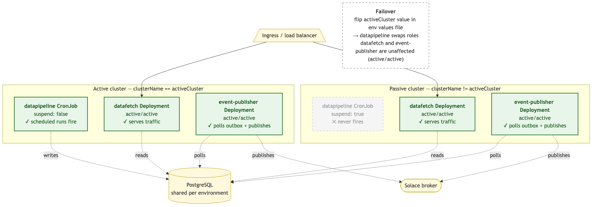

# Operations & Maintenance

## Overview

Phase 2 operations focus on three areas:

1. **Monitoring** — outbox health, publisher throughput, Solace connectivity
2. **Manual intervention** — recovering from failed or stuck events without data loss
3. **Capacity planning** — when to scale publisher replicas, when to adjust batch or poll settings

## Monitoring

### Outbox health (PostgreSQL)

The `event_outbox` table is the primary observability surface. Status counts give an immediate view of system health:

```sql
SELECT status, COUNT(*)
FROM esl.event_outbox
GROUP BY status;
```

Expected distributions:

| Distribution | Meaning |
|---|---|
| Mostly `DELIVERED`, near-zero `PENDING` | Normal operation — publisher keeps up with producer |
| Growing `PENDING` | Publisher not running, crashed, or unable to reach Solace |
| Growing `FAILED` | Transform or publish errors — see runbook |

> **No initial CREATED/DELETED spike is expected after a CDC enable.** The rollout sequence (see [06-deployment.md](06-deployment.md)) populates each environment's database with `cdc.enabled: false`: VLink skips DELETED-row fetches and the sink writes no outbox events during the initial full sync. By the time CDC is flipped on, the entity tables already mirror Vusion's current state — subsequent pre-fetch + diff cycles produce events only on real ongoing changes. If CDC were instead enabled against an empty DB, the first run would emit a CREATED event per active row plus a DELETED event per historical DELETED row VLink returns (≈6,600 outbox entries for a single reference store like `bomdia_pt.009648`: roughly 6,025 product + 631 label DELETED rows). Operators monitoring `event_outbox` post-enable should see volumes proportional to actual change rates, not initial-population magnitudes.

Useful supplementary queries:

```sql
-- Age of oldest pending event
SELECT MIN(occurred_at) AS oldest_pending,
       NOW() - MIN(occurred_at) AS age
FROM esl.event_outbox
WHERE status = 'PENDING';

-- Recent failed events
SELECT id, entity_type, event_type, occurred_at
FROM esl.event_outbox
WHERE status = 'FAILED'
ORDER BY occurred_at DESC
LIMIT 20;

-- Table size (for retention monitoring)
SELECT pg_size_pretty(pg_total_relation_size('esl.event_outbox')) AS total_size,
       COUNT(*) AS rows
FROM esl.event_outbox;
```

### Pipeline run lifecycle (`sync_state`)

The orchestrator inserts a `sync_state` row with `sync_status = 'running'` at the start of each run and updates it to `success` / `failed` at the end (see [03-database.md](03-database.md)). A handful of queries cover the common operational checks:

```sql
-- Live runs right now (one row per pipeline expected; multiple = concurrency issue)
SELECT pipeline_name, id AS run_id, started_at,
       NOW() - started_at AS age
  FROM esl.sync_state
 WHERE sync_status = 'running'
 ORDER BY started_at;

-- Most recent run per pipeline with outcome
SELECT DISTINCT ON (pipeline_name)
       pipeline_name, sync_status, started_at, finished_at,
       finished_at - started_at AS duration, error_message
  FROM esl.sync_state
 ORDER BY pipeline_name, started_at DESC;

-- Runs swept on startup as orphaned (post-PR-3 indicator of a previous crash)
SELECT pipeline_name, id, started_at, finished_at
  FROM esl.sync_state
 WHERE error_message = 'orphaned by orchestrator restart'
 ORDER BY finished_at DESC LIMIT 20;
```

**Alerting note.** Time-windowed alerts on `sync_status = 'failed'` should restrict to `finished_at` within the window, not `started_at` — a `running` row started just before the window has not failed yet, only its eventual terminal update would land inside the window.

### Publisher metrics (OpenTelemetry)

The event-publisher exports the following OTel metrics via the shared collector:

- `event_publisher.events_processed_total` — Counter, attributes `entity_type`, `event_type`, `status`. Investigate when the `status=failed` rate > 0.
- `event_publisher.poll_batch_size` — Histogram. Investigate when values are consistently at `batch_size` (100) — indicates the publisher is lagging.
- `event_publisher.poll_cycles_total` — Counter. Investigate when it stops incrementing — the publisher is deadlocked or has crashed.
- `solace.producer.publish_retries` — Counter. Investigate when the rate > 0 — broker latency or connection instability.
- `solace.core.connection_drops` — Counter. Investigate when any non-zero count appears — broker-side or network issue.

### Log filtering (Zap)

The event-publisher uses structured JSON logs. All log entries include `event_id`, `entity_type`, and `status` when relevant. Useful queries:

```sh
# All warn/error logs in last hour
kubectl logs -l app=orchestrator-esl-eventpublisher --since=1h | \
  jq -c 'select(.level == "warn" or .level == "error")'

# Trace a specific event end-to-end
kubectl logs -l app=orchestrator-esl-eventpublisher --since=24h | \
  jq -c 'select(.event_id == "a0eebc99-9c0b-4ef8-bb6d-6bb9bd380a11")'

# Group publish failures by error message
kubectl logs -l app=orchestrator-esl-eventpublisher --since=24h | \
  jq -r 'select(.msg == "publish failed") | .error' | \
  sort | uniq -c | sort -rn
```

## Runbook

### Publisher pod stuck in CrashLoopBackOff

**Common causes:**

1. ExternalSecret has not reconciled — missing or malformed Vault entries
2. Solace credentials invalid — OAuth2 token acquisition or broker authentication fails
3. DB credentials invalid — pool fails to initialize

**Diagnosis:**

```sh
kubectl describe pod -l app=orchestrator-esl-eventpublisher | tail -30

# Check ExternalSecret status
kubectl get externalsecret orchestrator-esl-eventpublisher -o yaml | yq '.status'

# Check resulting Secret has all expected keys
kubectl get secret orchestrator-esl-eventpublisher -o json | jq '.data | keys'
```

Expected keys in the resulting Secret:
```
DbHost, DbPort, DbUser, DbPassword, DbName, DbSchema,
SolaceClientId, SolaceClientSecret
```

Non-sensitive Solace config (`host`, `vpn`, `auth_scheme`, `token_endpoint`, `scope`, `topic_prefix`) is sourced from the ConfigMap, not the Secret.

**Fix:**

- **ExternalSecret `SecretSyncedError`:** verify Vault entries at `{vaultBasePath}/solace` exist and contain `client-id` and `client-secret`. After fixing Vault, force a refresh:
  ```sh
  kubectl annotate externalsecret orchestrator-esl-eventpublisher force-sync=$(date +%s) --overwrite
  ```
- **Solace auth fails — broker rejects token:** rotate the OAuth2 client secret in the IdP, update `{vaultBasePath}/solace.client-secret` in Vault. If the broker reports issuer/audience/scope mismatch, verify the OAuth profile on the broker still trusts the IdP's issuer and that the requested `scope` (in the env values file under `eventPublisher.config.solace.scope`) matches what the profile expects.
- **Solace auth fails — token endpoint unreachable:** confirm the IdP's TLS cert is trusted by the pod's system trust store (pod logs will show `x509: certificate signed by unknown authority`) and that egress to the `token_endpoint` host is allowed by the network policy.
- **DB auth fails:** same procedure, for `{vaultBasePath}/database`.

### Outbox `PENDING` backlog is growing

**Diagnosis:**

```sh
# Is publisher running?
kubectl get pods -l app=orchestrator-esl-eventpublisher

# Is publisher making poll progress?
kubectl logs -l app=orchestrator-esl-eventpublisher --since=5m --tail=200 | \
  jq -c 'select(.msg | contains("poll cycle"))'

# Is Solace reachable?
kubectl exec -it deploy/orchestrator-esl-eventpublisher -- \
  curl -sf http://localhost:8081/ready
```

**Fix:**

- Publisher not running: address the CrashLoopBackOff case above.
- Publisher running but `/ready` returns 503: the Solace connection dropped. The publisher auto-reconnects per `reconnect_retries` and `reconnect_wait`. If stuck:
  ```sh
  kubectl rollout restart deployment/orchestrator-esl-eventpublisher
  ```

### Outbox `FAILED` events

Every FAILED event has a reason in the publisher's logs. The three categories:

1. **Unsupported entity type** — datapipeline wrote an event type the publisher doesn't know (should never happen after Phase 2 ships; indicates a datapipeline bug)
2. **Missing key fields** — `retail_chain_id` or `store_id` missing from `entity_key`
3. **Publish failure** — Solace unreachable or confirmation timeout exceeded after internal retries

**Recover by resetting to PENDING** after fixing the root cause:

```sql
-- Reset specific failed events (preferred — surgical)
UPDATE esl.event_outbox
SET status = 'PENDING', delivered_at = NULL
WHERE id = ANY('{uuid1,uuid2,uuid3}'::uuid[]);

-- Reset all failed events in a time window
UPDATE esl.event_outbox
SET status = 'PENDING', delivered_at = NULL
WHERE status = 'FAILED'
  AND occurred_at > NOW() - INTERVAL '1 hour';

-- Reset everything FAILED (only if root cause was broker-wide and all should retry)
UPDATE esl.event_outbox
SET status = 'PENDING', delivered_at = NULL
WHERE status = 'FAILED';
```

On the next poll cycle the publisher picks them up.

**Consumer deduplication note:** delivery is at-least-once. Resetting a FAILED event may cause a duplicate publish if the original actually reached Solace but the status update failed. The `eventId` (outbox UUID) stays the same across retries — consumers dedupe by that field.

### Inspect a specific event's contents

```sql
SELECT
  id,
  event_type,
  entity_type,
  entity_key,
  jsonb_pretty(payload) AS payload,
  status,
  occurred_at,
  delivered_at
FROM esl.event_outbox
WHERE id = 'your-uuid-here';
```

### Recover from a falsely-successful store run

A pre–PR-2 run could mark a store as `success` while the sink was silently dropping records (e.g. unique-constraint violations cascading through a pgx batch). The watermark advanced past the failed records, so the next incremental run skipped them. After PR 2 such runs surface as `failed` and the watermark stays put — but historical leaks need a one-time manual recovery.

**Symptoms.** A store row in `store_sync_state` has `sync_status = 'success'` but the destination table has fewer rows than `*_processed` reports, and `records_with_errors` either contains entries for that run or is suspiciously empty for the same `synced_at`.

**Recovery (widen lookback for one run).** Roll back the affected store's watermark by the smallest interval that covers the missed records, then trigger a normal run:

```sql
-- Replace <pipeline>, <retail_chain> and <store> with the affected values.
UPDATE esl.store_sync_state
   SET synced_at = synced_at - INTERVAL '6 hours'
 WHERE pipeline_name = '<pipeline>'
   AND retail_chain_id = '<retail_chain>'
   AND store_id = '<store>'
   AND id = (
     SELECT MAX(id) FROM esl.store_sync_state
      WHERE pipeline_name = '<pipeline>'
        AND retail_chain_id = '<retail_chain>'
        AND store_id = '<store>');
```

**Alternative.** Bump the orchestrator's `sync.lookback_window` config to a value large enough to cover the gap and run once; revert to the normal window afterwards.

After the recovery run, verify: the store should show `success` with a `*_processed` count consistent with the destination table, and `records_with_errors` should reflect any rows that genuinely failed permanent validation.

### Stale `running` row at startup (orphan sweep fired)

On startup, the orchestrator looks for `sync_state` rows belonging to its `pipeline_name` that are still in `running` and flips them to `failed` with `error_message = 'orphaned by orchestrator restart'`. A log line surfaces only when the sweep actually updates rows:

```json
{"level":"info","msg":"Swept orphaned running rows","count":1,"pipeline_name":"esl-orchestrator-pp"}
```

This means the previous orchestrator instance for this pipeline died between the start-of-run insert and the end-of-run update — typical causes: pod OOMKilled, node eviction, hard shutdown without SIGTERM, an unhandled panic. The swept row's `started_at` is the timestamp the dead run began; subtract it from the sweep time to estimate how long it was orphaned.

**Pipeline-name uniqueness is the safety boundary.** The sweep matches strictly on `pipeline_name` and treats every `running` row in scope as dead. If two orchestrators share the same `pipeline_name` and run at the same time, the second one's startup will mark the first one's in-flight row as `failed` while the first is still alive (concurrent orchestrators on a single pipeline-name is documented as out of scope — see [04-datapipeline.md](04-datapipeline.md)).

Triage:

- Cross-reference the `started_at` of the swept row with pod restart events / kubelet logs to confirm a crash occurred.
- The records the orphaned run was processing remain at the source — the next normal run picks them up via the unchanged `store_sync_state` watermarks.
- A swept row with `started_at` far in the past (hours+) usually indicates the orchestrator was disabled rather than crashed; double-check the deployment was intentional.

If the sweep itself fails (state DB briefly unreachable at startup), a warn log fires and the new running row is still inserted — the next successful startup eventually catches up.

### Investigate failed records for a specific run

After PR 3, every row in `records_with_errors` carries `run_id`, `retail_chain_id`, `store_id`, `pipeline_name`, and `entity_type`. Use them to triage a specific failed run:

```sql
-- All failures for the most recent failed run on a pipeline
WITH latest AS (
  SELECT id FROM esl.sync_state
   WHERE pipeline_name = '<pipeline>'
     AND sync_status = 'failed'
   ORDER BY started_at DESC LIMIT 1
)
SELECT entity_type, retail_chain_id, store_id,
       COUNT(*) AS failures,
       array_agg(DISTINCT pg_error_code) AS pg_codes
  FROM esl.records_with_errors
 WHERE run_id = (SELECT id FROM latest)
 GROUP BY entity_type, retail_chain_id, store_id
 ORDER BY failures DESC;

-- One specific failing record's payload + classification
SELECT data, error_message, pg_error_code, error_type
  FROM esl.records_with_errors
 WHERE run_id = $1 AND record_id = $2;
```

**Pre-PR-3 rows.** Rows older than the V1.0.0.22 migration carry NULL in all five correlation columns. Dashboards and ad-hoc queries that filter on `run_id` should `WHERE run_id IS NOT NULL` (or accept that pre-migration data is invisible to the new query patterns).

### Ack-leak warning in pipeline logs

A log line like the following surfaces from `cmd/eslorchestrator/run.go` after `pipeline.Run` returns:

```json
{"level":"warn","msg":"ack leak detected after pipeline run","total_pending":42,"by_store":{"<store>":42}}
```

This always indicates a code defect — either a pipeline-side drop site that forgot to invoke the OutcomeHandler, or a sink that violated the contract that requires reporting every record before `Close` returns. The corresponding store(s) get classified as `failed: ack leak: N records unaccounted for` in `store_sync_state` so the watermark does not advance.

Triage:

- Cross-reference the affected store IDs with recent connector / sink changes.
- The pipeline's `processRecord` calls the OutcomeHandler on transform/preprocess errors and the sink reports per-record outcomes via `flushBatch`, the `Write()` boundary rejection branch, and `drainOnCancel` on shutdown — any new drop site must do the same.
- Re-run the pipeline once the underlying defect is fixed; the records sit untouched at the source so they will re-emit cleanly.

### Drain the outbox urgently (emergency only)

If a backlog is safe to discard (e.g., accumulated test data, intentional rollback), mark events as DELIVERED without publishing:

```sql
-- DANGER: these events will NOT be sent to Solace.
-- Use only when the backlog must not be published.
UPDATE esl.event_outbox
SET status = 'DELIVERED', delivered_at = NOW()
WHERE status = 'PENDING'
  AND occurred_at < NOW() - INTERVAL '1 day';
```

Preferred alternative: stop the producer (flip `cdc.enabled: false`), let the publisher drain the queue naturally, then re-enable.

## Scaling

### Publisher replicas

The publisher uses `SELECT ... FOR UPDATE SKIP LOCKED`, so multiple replicas can run concurrently without coordination. Each replica claims distinct rows.

**Single replica (default):**

- Per-entity ordering is preserved — events for the same entity are always delivered in outbox order
- Simpler to monitor (single log stream, single publisher identity in metrics)
- Sufficient for typical ESL workloads (the theoretical ceiling at `pollInterval: 1s, batchSize: 100` is 10,000 events/sec, far above observed rates)

**Multiple replicas:**

- Scales throughput up to the broker's accepted rate
- **Breaks per-entity ordering** — two updates to the same entity may be claimed by different replicas and arrive at Solace out of order
- Required only if single-replica throughput saturates or if high-availability during rolling restart matters
- Increase `replicaCount` in `values-{env}.yaml` under `eventPublisher`

### Batch size and poll interval

| Setting | Default | Increase when | Decrease when |
|---|---|---|---|
| `publisher.batchSize` | 100 | Outbox backlog grows, events produced > consumed | Large batches cause long transaction locks; memory pressure |
| `publisher.pollInterval` | `1s` | Events are sparse, want to reduce DB load | Latency-sensitive delivery needed |

Changes require a Helm values edit and redeploy — no DB migration involved.

### Data pipeline CDC overhead

As documented in [04-datapipeline.md](04-datapipeline.md), CDC adds approximately 30–100% overhead per batch depending on the change ratio. Mitigations if runtime becomes a problem:

1. Profile which entity types drive the most events using the `sink.cdc.events` metric grouped by `event_type`
2. Lower `sink.postgres.batch_size` (currently 500) if per-batch transaction time is too long
3. For one-off heavy loads (full re-sync), temporarily disable CDC (`cdc.enabled: false`), run the sync, then re-enable

## Outbox Retention

Migration V1.0.0.18 (event_outbox_retention) handles periodic cleanup:

- DELIVERED rows older than the retention window (default: 7 days) are purged
- FAILED rows are never purged automatically — manual intervention is required

Monitor table size:

```sql
SELECT pg_size_pretty(pg_total_relation_size('esl.event_outbox')) AS total_size;

-- Count of rows eligible for purge
SELECT COUNT(*)
FROM esl.event_outbox
WHERE status = 'DELIVERED'
  AND delivered_at < NOW() - INTERVAL '7 days';

-- Count of unresolved FAILED rows (investigate if this grows)
SELECT COUNT(*) FROM esl.event_outbox WHERE status = 'FAILED';
```

## Graceful Shutdown

The event-publisher handles SIGTERM cleanly:

1. Kubernetes sends SIGTERM (e.g., during rolling deployment)
2. Publisher stops accepting new poll cycles, finishes any in-flight batch
3. In-flight transaction commits — rows become DELIVERED or FAILED; no rows left in intermediate state
4. Solace client disconnects cleanly
5. Pod exits

If `shutdownTimeout` (default `30s`) is exceeded, Kubernetes sends SIGKILL. Consequences:

- The in-flight transaction rolls back; rows revert to PENDING
- The next pod picks them up on startup
- No data loss (at-least-once)
- Possible duplicate publishes if the pre-rollback batch had partially delivered to Solace (consumers dedupe by `eventId`)

## Active/Passive Failover

> **Note: this is a temporary mechanism.** The active/passive setup and the manual failover procedure described below are interim measures adopted to enable multi-cluster operation within Phase 2 timelines. Future phases of the project will replace this with a more robust approach to multi-cluster scheduling — likely a DB-backed lease for automatic leader election — removing the need for coordinated `activeCluster` values flips. The values-flip mechanism documented here is not the long-term design.

The ESL Orchestrator is deployed to two OpenShift clusters per environment in an active/passive pattern for the components that publish externally — the datapipeline CronJob and the event-publisher Deployment. One cluster is designated active. There the CronJob runs on schedule and the Deployment runs at its configured replica count. The other cluster renders the same chart but with `spec.suspend: true` on the CronJob and `spec.replicas: 0` on the Deployment, so both resources exist but neither fires nor runs pods. The `datafetch` REST API stays active/active across both clusters; only the two publishing components are gated. Gating event-publisher avoids duplicate publishes to Solace from two clusters running in parallel.



### Mechanism

Two values drive the decision at Helm render time:

| Value | Source | Per cluster? |
|---|---|---|
| `clusterName` | Injected by ArgoCD via `helm.parameters` in each per-cluster Application | Yes — each cluster's Argo passes its own identity |
| `activeCluster` | Top-level value in `clusters/cluster-{env}/values-{env}.yaml` | No — shared across both clusters in an environment |

The datapipeline CronJob template renders:

```yaml
suspend: {{ or $dp.suspend (ne .Values.clusterName .Values.activeCluster) }}
```

On the active cluster, `clusterName == activeCluster` → `suspend: false`. On the passive cluster, `clusterName != activeCluster` → `suspend: true`.

The event-publisher Deployment template renders:

```yaml
replicas: {{ if ne .Values.clusterName .Values.activeCluster }}0{{ else }}{{ $ep.replicaCount | default 1 }}{{ end }}
```

On the active cluster, replicas resolves to the configured `eventPublisher.replicaCount` (default `1`). On the passive cluster it resolves to `0`, so the Deployment object exists but has no pods.

The `dataPipeline.suspend` override (see [06-deployment.md](06-deployment.md)) is an optional boolean that force-suspends the CronJob on top of the cluster check — useful for ad-hoc maintenance pauses on the active cluster without touching `activeCluster`. It is one-way: setting it to `false` cannot un-suspend the passive cluster. There is no equivalent override for event-publisher; to pause it on the active cluster, scale the Deployment manually or set `eventPublisher.replicaCount: 0`.

Cluster identities per environment:

| Environment | Active | Passive |
|---|---|---|
| pp | `oshift-pp-rba1` | `oshift-pp-mts1` |
| prd | `oshift-prd-rba1` | `oshift-prd-mts1` |

### Identifying the active cluster as unhealthy

Signals that warrant a failover:

- Datapipeline has not had a successful run on the active cluster across a full schedule window (prd schedule: `00 12 * * *`).
- OpenShift cluster-level outage affecting the active cluster (node failures, network partition, control plane degraded).
- ArgoCD unable to sync the ESL Application on the active cluster.

Quick checks:

```sh
# Latest datapipeline Job status on the active cluster
kubectl --context <active-cluster> get jobs -n instore-esl-orchestrator-prd \
  -l app=orchestrator-esl-datapipeline --sort-by=.status.startTime | tail -5

# Latest esl.sync_state row
psql -c "SELECT client, sync_status, sync_end_time FROM esl.sync_state
         WHERE client = 'esl-orchestrator-prd'
         ORDER BY sync_end_time DESC LIMIT 5;"
```

### Performing a failover

1. Edit the env's values file in the `sonaemc-instore/lac1041-instoreorchestrator_esl` repo and flip `activeCluster` to the passive cluster's name. For a prd failover from `rba1` to `mts1`:

   ```yaml
   # clusters/cluster-production/values-prd.yaml
   activeCluster: "oshift-prd-mts1"
   ```

2. Commit and push. The same values file is consumed by both per-cluster Argo Applications, so a single edit reaches both clusters.
3. Wait for Argo to sync on both clusters (or force a sync from the Argo UI).

### Post-failover verification

Confirm the CronJob `suspend` flag flipped and the event-publisher Deployment scaled on both clusters:

```sh
# New active cluster — expect CronJob "false" and Deployment replicas >= 1
kubectl --context <new-active> get cronjob -n instore-esl-orchestrator-prd \
  orchestrator-esl-datapipeline -o jsonpath='{.spec.suspend}'
kubectl --context <new-active> get deploy -n instore-esl-orchestrator-prd \
  orchestrator-esl-eventpublisher -o jsonpath='{.spec.replicas}'

# Old active (now passive) — expect CronJob "true" and Deployment replicas 0
kubectl --context <old-active> get cronjob -n instore-esl-orchestrator-prd \
  orchestrator-esl-datapipeline -o jsonpath='{.spec.suspend}'
kubectl --context <old-active> get deploy -n instore-esl-orchestrator-prd \
  orchestrator-esl-eventpublisher -o jsonpath='{.spec.replicas}'
```

After the next schedule tick:

- A new Job is created on the new active cluster; no Job is created on the old active.
- `esl.sync_state` shows one new row for `esl-orchestrator-prd` with the expected `sync_end_time`.
- Event-publisher pods are running on the new active cluster and absent on the old active; new outbox rows are drained by the new active's pods.

### Rollback

Edit the same values file and flip `activeCluster` back to the original cluster. Verification steps are identical — `suspend: false` and event-publisher replicas >= 1 should reappear on the original active cluster, and `suspend: true` with replicas `0` on the other.

## Disaster Recovery

### Outbox table corrupted or lost

The outbox is not a system of record — entity data in `stores`, `products`, `labels`, `access_points` is. Events can be reconstructed by forcing a full re-sync:

1. Stop the datapipeline CronJob (suspend it)
2. Reset `store_sync_state` to an earlier timestamp to force re-sync of all changed-since data
3. Re-enable the CronJob
4. Next run produces fresh events into the rebuilt outbox
5. Publisher delivers them

Caveat: re-synced events report as UPDATED (not CREATED), because the data is already in place. Consumers that distinguish the two must account for this.

### Solace Cloud extended outage

The publisher marks failed publishes as FAILED. Short outages recover automatically via the publisher's internal retries; longer outages cause the backlog to grow.

For prolonged outages (hours), monitor:

- `event_outbox` row count and disk usage
- `/ready` endpoint status on the publisher pods

When Solace recovers, reset FAILED events to PENDING (see runbook) and allow the publisher to drain the backlog.

### Publisher unable to keep up

If the publisher consistently cannot drain the outbox (publish rate < produce rate):

1. Scale `replicaCount` up (accepting the loss of per-entity ordering)
2. Investigate Solace broker-side limits (queue depth, publish rate throttles)
3. Consider partitioning the outbox by entity_type at the consumer side (out of scope for Phase 2, revisit in Phase 3)
