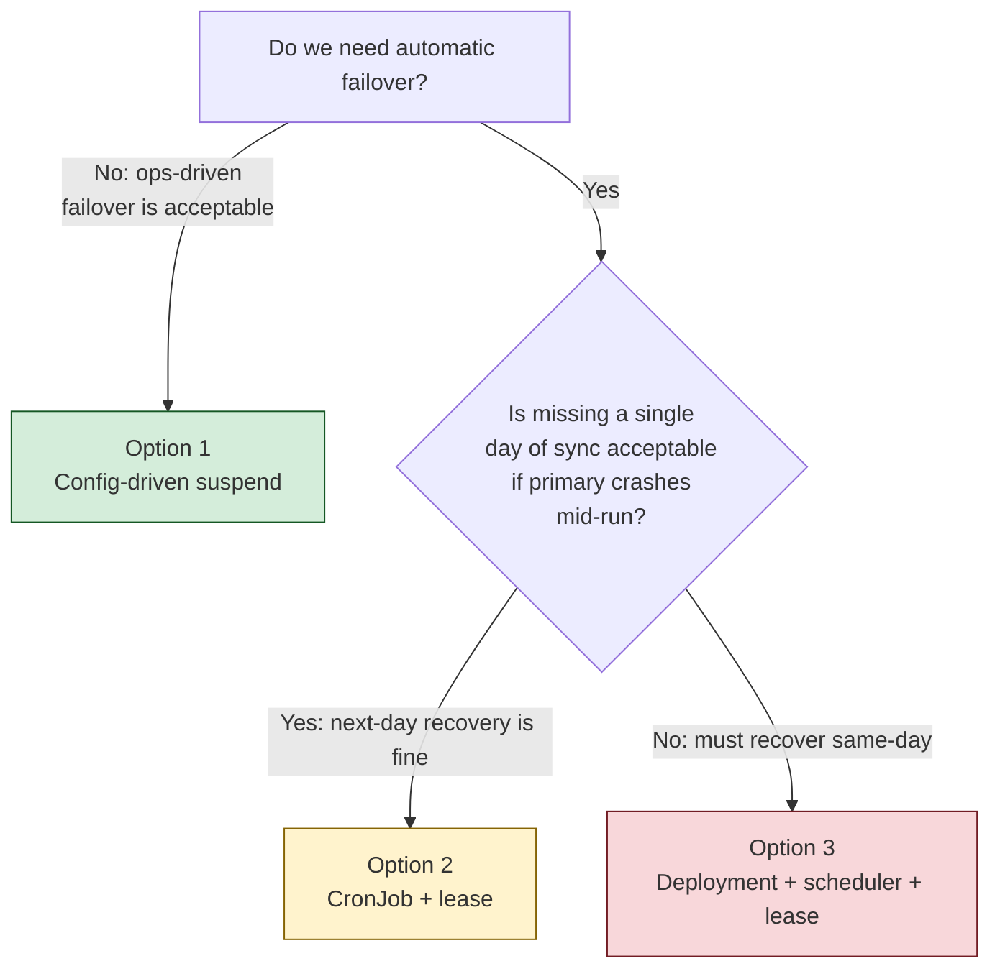

# ESL Orchestrator — Active/Passive Options Overview

## Problem

The production ESL Orchestrator is deployed to two OpenShift clusters (`oshift-prd-mts1` and `oshift-prd-rba1`) in an active/active pattern. Both clusters run an identical workload because they share the same Helm chart and values file. Two of those workloads have a concrete cost when duplicated:

1. **`datapipeline` CronJob** — syncs data from the Vusion API into PostgreSQL daily at 19:00 (Europe/Lisbon). The Vusion subscription enforces a **daily quota**. Two clusters firing the same job at the same time consume the quota twice.
2. **`event-publisher` Deployment** (Phase 2, not yet in production) — polls the transactional outbox and publishes events to Solace continuously. Already safe under active/active thanks to `FOR UPDATE SKIP LOCKED` on the outbox, but it still doubles DB polling load.

The REST API (`datafetch`) is correctly active/active — stateless reads benefit from load distribution across both clusters.

## Target

Move the two stateful writers (`datapipeline` and, when it ships, `event-publisher`) to an **active/passive** pattern: exactly one cluster performs the work; the other is a standby that takes over on failure.

## Shared context all options rely on

- PostgreSQL lives **outside** both Kubernetes clusters and is reachable from both (its own HA story, independent of K8s).
- Vusion is an external SaaS, reachable from both clusters.
- ArgoCD runs in each cluster locally (hub-per-cluster model); each cluster's Argo bootstraps from the same git repo but can receive different Helm parameters at install time.
- Each cluster already carries a distinct identity: the label `cluster=oshift-prd-mts1` / `cluster=oshift-prd-rba1` is visible on every pod via `metadata.labels['cluster']`, already wired into `OTEL_CLUSTER_NAME`.

## Three options in scope

Each option is described in its own report in this directory. They differ along two axes: **who arbitrates** (ops / ArgoCD / database / application) and **whether failover is automatic**.

| # | Report | Mechanism | Failover | Change size |
|---|--------|-----------|----------|-------------|
| 1 | [01-config-driven-suspend.md](01-config-driven-suspend.md) | Render-time `suspend` in the CronJob driven by a single value (`activeCluster`) + `clusterName` passed in by ArgoCD. | **Manual** (ops edits values file, Argo syncs) | Smallest: ~1 Helm line + 1 foundations-repo parameter |
| 2 | [02-cronjob-with-lease.md](02-cronjob-with-lease.md) | CronJob stays a CronJob; both clusters fire; race to acquire a DB-backed lease; loser exits. | **Automatic for whole-cluster failures** (next-day recovery for mid-run crashes) | Medium: 1 DB table + ~100 LoC Go library + small config |
| 3 | [03-deployment-with-scheduler.md](03-deployment-with-scheduler.md) | Convert CronJob to Deployment; long-running pods compete for one lease continuously; active pod uses an internal scheduler; new leader fires a catch-up run. | **Automatic incl. mid-run** (seconds after primary dies) | Largest: Helm restructure + in-process scheduler + health endpoints |

## Side-by-side comparison

| Dimension | 1. Config-driven | 2. CronJob + lease | 3. Deployment + scheduler |
|---|---|---|---|
| Solves Vusion quota doubling | Yes | Yes | Yes |
| Ops effort during a cluster outage | Edit values, commit, wait for sync | None | None |
| Mid-run crash recovery | Next day (manual) | Next day | Same day (seconds) |
| New infrastructure | None | 1 Postgres table | 1 Postgres table + in-pod scheduler |
| Go code changes | None | ~100 LoC in `common/` + ~20 LoC in datapipeline | ~300 LoC incl. scheduler + health probes |
| Helm chart changes | 1 line (`suspend: …`) + `helmParameters` in foundations | New config block for lease | CronJob → Deployment migration |
| Continuous observability (24/7) | No (pods only run during scheduled window) | No (same) | Yes (pods always up, probeable) |
| Deviation from current architecture | None | None | Moderate (new pod shape) |
| Reusability for event-publisher | Not applicable (event-publisher is already a Deployment) | Yes, same lease primitive | Yes, same primitive + same pod shape |
| Rollback safety | Change one value in git | Feature flag `leader_lease.enabled: false` | Revert Helm manifest to CronJob |
| Risk of regression in current prd behavior | Very low | Low | Medium |
| Time to implement (engineering days) | ~1–2 | ~5–7 | ~15–20 |

## Decision guide

(Colour coding: green = smallest change; amber = balanced; red = largest change — reflects engineering effort, not "bad".)

## Scope note

All three options apply to the `datapipeline` CronJob. For `event-publisher` (Phase 2), the natural fit is option 3's lease primitive since it is already a long-running Deployment — the lease can be added without any shape change. Whichever option is chosen for `datapipeline`, the same lease library (if introduced) can be reused by `event-publisher` at rollout time.

## Scaling context — the 300-store production flip

The three active/passive options above solve the **quota-doubling** problem for `datapipeline`. They do **not** solve the separate **throughput** problem that surfaces when production is expanded from the current 4-store pilot to the full 300-store catalog.

### Worst-case rollout volume

Assuming 300 stores × 25k products and 25k labels per store are flipped in a single rollout with CDC enabled:

| Dimension | Value |
|---|---|
| Stores | 300 |
| Products per store | ~25,000 |
| Labels per store | ~25,000 |
| Products total | ~7,500,000 |
| Labels total | ~7,500,000 |
| Outbox rows emitted in initial full sync | **~15,000,000+** |

### Event-publisher throughput needed (orthogonal to datapipeline active/passive)

At this volume, a single-pod event-publisher with the current configuration (`batchSize: 100`, `pollInterval: 1s`, sequential publish) drains the initial spike in **tens of hours** — unacceptable. Even with aggressive config tuning (`batchSize: 500`, `pollInterval: 250ms`), it's still ~8 hours.

To keep the initial-flip drain below ~1 hour requires **in-pod parallel publishing** (~20 goroutine workers per pod with publish-then-commit-in-fetch-order to preserve ordering). Daily deltas (estimated 150k–750k events/day at 1–5% change rate) also benefit: ~1–6 min with parallelism vs. 25 min – 2 h sequentially.

If a single parallelised pod still saturates under the flip, the next step is **partitioned leases**: add `partition_key INT` to `event_outbox`, introduce N lease slots, each pod owns one partition. Preserves per-entity ordering while scaling throughput horizontally. This is an *additive* extension to whichever lease library is built for datapipeline — not a rewrite.

### Why this matters for the reports that follow

- In-pod parallelism on `event-publisher` is a **prerequisite for the 300-store rollout**, regardless of which of the three datapipeline options is picked.
- It's a **separate workstream** from the active/passive question (no bearing on the Vusion quota concern).
- The lease library, if built for datapipeline, should be **designed with a partition-slot parameter from day one** so extending it later for horizontal publisher scaling is additive.

### Pre-flip sizing checks (must be confirmed with ops before rollout)

- **Solace broker:** can it sustain ~5k guaranteed publishes/sec on the `in-store/orchestratoresl/*` topics?
- **Postgres WAL + autovacuum:** 15M outbox inserts in ~1 hour is ~4k rows/sec of WAL plus index maintenance on `event_outbox`.
- **Outbox retention:** current default is 7 days (`V1.0.0.18__event_outbox_retention.sql`). 15M rows × 7 days = 105M rows retained at peak — revisit retention and consider partitioning the table.

## Open items that block implementation regardless of option chosen

1. **Ops confirmation** of the exact `clusterName` value passed to each physical production Argo at install time. The PP cluster label today is `oshift-pp-mts1`; production is assumed to be `oshift-prd-mts1` / `oshift-prd-rba1` but must be confirmed.
2. **Vusion quota reset mechanics** — calendar-day reset (midnight Lisbon) vs rolling 24h. Matters for understanding "missing a run" severity.
3. **PostgreSQL failover semantics** — if the DB has its own HA, both clusters will always see the same writable primary via a shared VIP/DNS. Any option relying on DB state assumes this.

## Next step

Pick one option. Each report ends with a "What to do next" section that lists the concrete follow-up (scoped plan, cross-repo PRs, rollout order).
