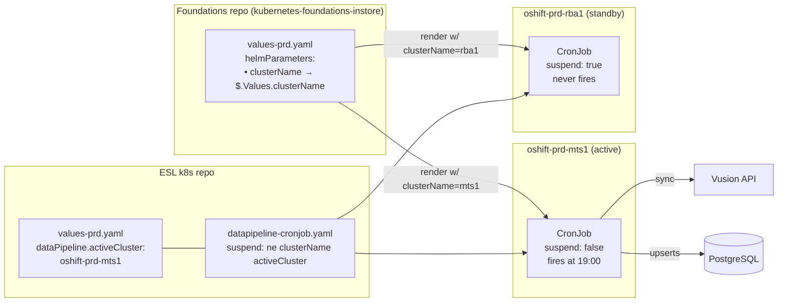
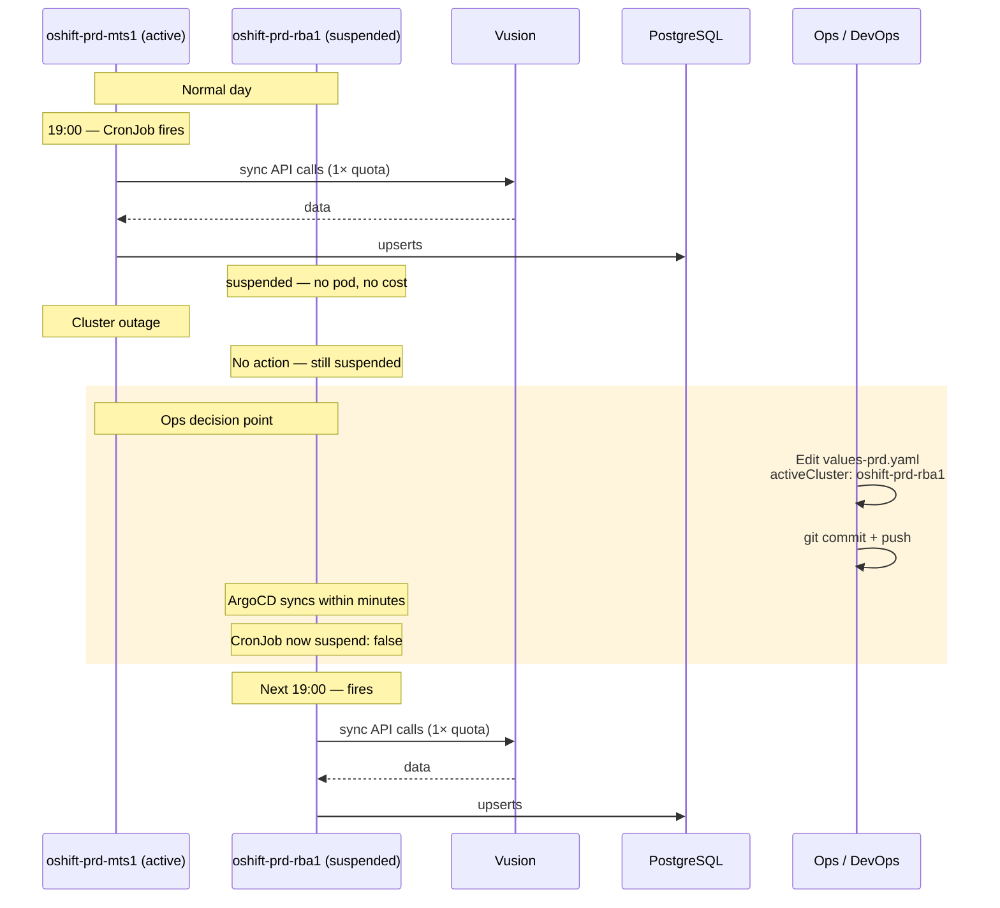

# Option 1 — Config-driven active/passive via `suspend`

> **Outcome (2026-04-29):** Option 1 was selected and shipped for `datapipeline`. `event-publisher` is **out of scope** for active/passive — it stays active/active via `SELECT … FOR UPDATE SKIP LOCKED` on `event_outbox`. Any pros/cons below that hinge on extending this mechanism to event-publisher are obsolete; see `config-driven.md` for the live implementation plan.

**One-liner:** both clusters deploy the CronJob, but the template renders `spec.suspend: true` on whichever cluster is not the currently-designated active one. Failover is a single-value edit.

## How it works

- A new value in the ESL chart: `dataPipeline.activeCluster`, set to e.g. `oshift-prd-mts1`.
- The ArgoCD foundations repo passes the physical cluster's identity (`clusterName`) into the ESL chart as a Helm parameter. This identity already exists per cluster; it just isn't plumbed into this particular chart today.
- In the CronJob template, `spec.suspend` is rendered as `ne clusterName activeCluster`: true on every cluster except the active one.
- On the suspended cluster, the CronJob resource exists but never fires. No pod ever starts. No Vusion quota is consumed.
- To fail over, a human edits `activeCluster` in the values file, commits, and ArgoCD applies the flip within the normal sync window (seconds to a few minutes).

## Architecture

## Failover flow

## What changes

| Repo | File | Change |
|---|---|---|
| `kubernetes-foundations-instore` | `clusters/cluster-production/values-prd.yaml` | Add `helmParameters: [{name: clusterName, value: {{ $.Values.clusterName }}, forceString: true}]` to the ESL Application source. Same for PP. |
| `esl/k8s` | `clusters/cluster-production/values-prd.yaml` | Add `dataPipeline.activeCluster: oshift-prd-mts1`. |
| `esl/k8s` | `helm/templates/datapipeline-cronjob.yaml` | Add one line inside the CronJob `spec`: `suspend: {{ ne .Values.clusterName .Values.dataPipeline.activeCluster }}`. |

No Go code changes. No database migrations. No new libraries.

## Effort

| Task | Size |
|---|---|
| Foundations `helmParameters` PR | ~30 min |
| ESL chart changes + helm lint across envs | ~30 min |
| PP verification (confirm mts1 runs, mts2 is suspended) | ~1 hour across two scheduled windows |
| Production rollout | Same day |
| **Total** | **~1–2 engineering days, including cross-repo coordination** |

## Risks

| Risk | Likelihood | Mitigation |
|---|---|---|
| `clusterName` not actually set on one of the two physical clusters at install time | Medium | Verify with ops before rollout; the render would produce `activeCluster != ""` which means both suspended (no work runs — fails closed, which is safer than fails open). |
| Ops forgets to flip `activeCluster` during an outage → prolonged data staleness | Medium | Documented runbook; PagerDuty alert tied to `sync_state` showing no run in >36h. |
| Misconfigured `activeCluster` value (typo) → both clusters suspended | Low | Helm `lint` + pre-sync render preview in Argo catches this before pods are affected. |
| Bending the k8s/CLAUDE.md rule that prohibits `if .Values.X` guards | Low | The rule targets guards that hide entire resources; `suspend` is a first-class CronJob field accepting a boolean expression. Not a conditional block. |

## Pros

- **Smallest possible change.** No Go, no SQL, no new dependencies, no new pod shape.
- **Boring and inspectable.** `kubectl get cronjob -o yaml` clearly shows `suspend: true` — no special knowledge required to understand state.
- **Zero new failure modes.** If something breaks, it breaks the same way it does today (CronJob failure) — existing alerting and runbooks still apply.
- **Trivial rollback.** Revert the Helm change; both clusters go back to firing.
- **Deterministic.** No race condition, no lease expiry timing, no split brain.

## Cons

- **Manual failover only.** If `oshift-prd-mts1` is down at 18:45, someone must notice and flip the value before 19:00 — or the sync is skipped until the next day.
- **Human in the loop at 03:00.** If primary dies overnight, someone has to be paged to edit a values file.
- **Doesn't scale to event-publisher.** `event-publisher` is 24/7; "suspend a Deployment" exists (scale to 0 replicas) but the manual-failover story degrades for a continuously-running service. Event-publisher would need a different mechanism.
- **Cluster identity must be correct and unique** per physical cluster at Argo install time, forever.

## When to pick this

- The Vusion quota is the sum total of the pain; "missing a day" is tolerable.
- There is an ops team that responds to alerts within 1–2 hours and can action a git edit.
- We want to ship the smallest change that demonstrably closes the quota-doubling behaviour, then observe.

## When NOT to pick this

- If the business needs unattended failover (e.g., weekend outages where no one is paged).

## Note on event-publisher scaling (orthogonal to this option)

This option addresses the Vusion quota problem for `datapipeline`. It does **not** address `event-publisher` throughput at production scale.

At the full 300-store rollout (~15M outbox rows during initial CDC sync), a single-pod event-publisher with today's sequential configuration cannot drain in a reasonable window. In-pod parallel publishing (~20 goroutine workers) is a prerequisite for that rollout regardless of which datapipeline active/passive option is chosen. See `00-overview.md` § Scaling context for the numbers.

If this option is picked for `datapipeline`, `event-publisher` still requires its own throughput-oriented work before the 300-store flip.

## What to do next if this option is chosen

1. Ask ops to confirm the `clusterName` value set on each physical Argo at install time.
2. Open a PR in `kubernetes-foundations-instore` adding `helmParameters` to the ESL Application source. Coordinate with the team that owns that repo.
3. Open a PR in `esl/k8s` adding the `activeCluster` value and the `suspend` expression in the CronJob template. Run `helm lint` against all three cluster environments.
4. Roll out to PP first; observe at least two 19:00 windows (one normal, one with the value flipped) before promoting to prd.
5. Write a one-page runbook describing the failover procedure (edit values, commit, wait for Argo sync).
