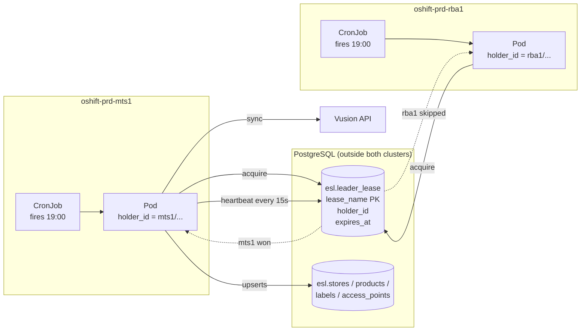
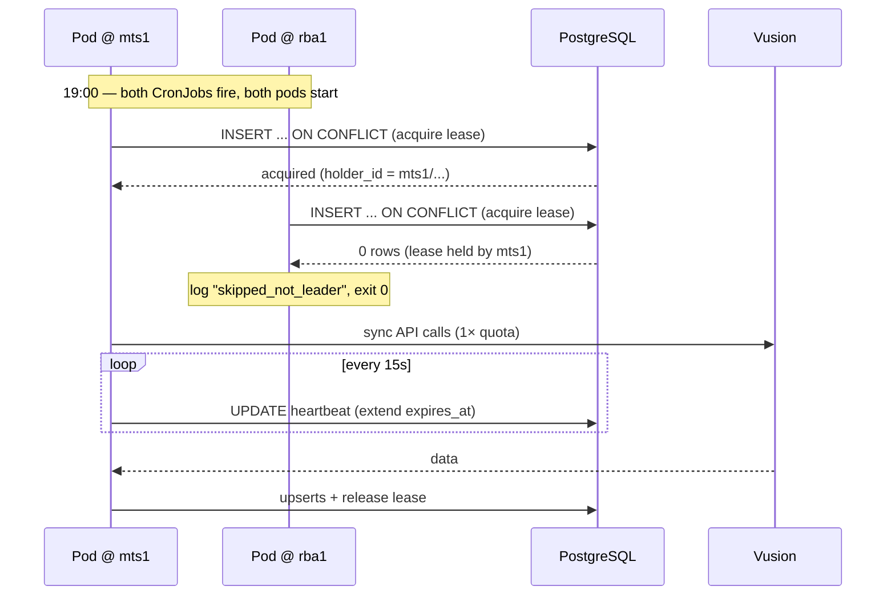
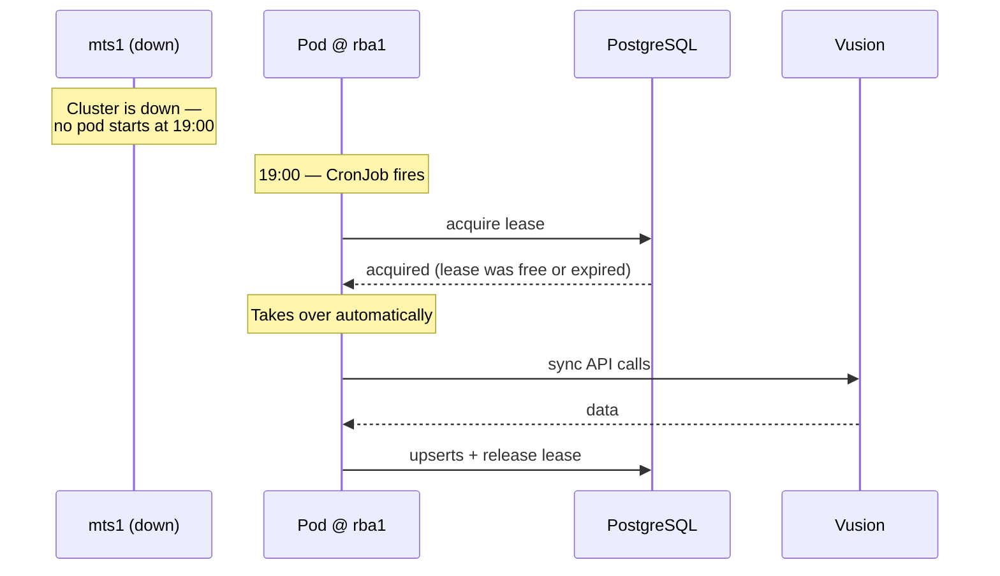
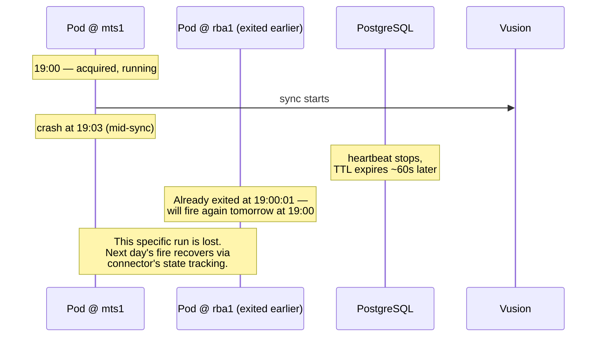

# Option 2 — CronJob with database-backed lease

> **Outcome (2026-04-29):** Option 2 was **not** chosen. Option 1 (config-driven suspend) was selected for `datapipeline`. `event-publisher` is out of scope for active/passive — it stays active/active via `SELECT … FOR UPDATE SKIP LOCKED` on `event_outbox`. Pros/cons below that frame the lease primitive as "reusable for event-publisher" are obsolete: that reuse is no longer planned.

**One-liner:** both clusters deploy the CronJob and both fire at the same time. A single Postgres row arbitrates who runs: the winner executes the sync, the loser exits cleanly. Automatic takeover for whole-cluster failures.

## How it works

- A new table `esl.leader_lease` holds one row per named pipeline, describing who currently holds the lease and when it expires.
- Both cluster CronJobs fire at 19:00 and start a pod. Each pod immediately attempts a single SQL statement (`INSERT ... ON CONFLICT DO UPDATE WHERE expires_at < now() OR holder_id = self`). Exactly one pod wins.
- The winner spawns a heartbeat goroutine that renews its lease every ~15 seconds while the sync runs. The loser logs a structured message (`lease.skipped_not_leader holder_id=…`) and exits with code 0.
- On completion (or crash), the winner releases the lease. The TTL (e.g. 60 seconds) guarantees that even if the winner dies abruptly, the row becomes available again for the next fire.
- If the winner **loses** the lease mid-run (DB blip, a slower heartbeat, clock skew), its own heartbeat UPDATE returns `rows affected = 0`. The pod self-aborts immediately, preventing two clusters from running simultaneously against Vusion (fence-token pattern).

## Architecture

## Failover flow — normal operation

## Failover flow — whole-cluster outage

## Failover flow — mid-run crash

## What changes

| Repo | File(s) | Change |
|---|---|---|
| `esl/database` | New `sql/V1.0.0.21__create_leader_lease.sql` | Creates `esl.leader_lease(lease_name PK, holder_id, acquired_at, expires_at, heartbeat_at)`. No retention trigger — the table holds a fixed small number of rows (one per pipeline). |
| `esl/common` | New package `common/lease/` | Library: `Acquire(ctx, name, holderID, ttl) -> Lease`, `Lease.StartHeartbeat(interval)`, `Lease.Release(ctx)`. Exposes a channel that closes when the lease is lost, so callers can cancel their context. |
| `esl/datapipeline` | `cmd/eslorchestrator/run.go` | At the top of Run: acquire lease using `OTEL_CLUSTER_NAME/HOSTNAME` as holder_id. If not acquired, log and exit 0. If acquired, start heartbeat, defer Release, wire the lease-loss channel into the pipeline context. |
| `esl/datapipeline` | `internal/config/` | New config block `leader_lease: { enabled, name, ttl, heartbeat_interval }` with sensible defaults (enabled=true, ttl=60s, heartbeat=15s). |
| `esl/k8s` | `helm/templates/datapipeline-cronjob.yaml` | Plumb lease config into the generated ConfigMap. No env/secret changes — lease uses the sink database pool that already exists. |

CronJob template itself is otherwise unchanged. `restartPolicy: Never`, `concurrencyPolicy: Forbid`, and `ttlSecondsAfterFinished` all retain their current semantics.

## Effort

| Task | Size |
|---|---|
| Flyway migration in `esl/database` | ~1 hour |
| Lease library in `esl/common` with unit + integration tests | ~1 day |
| Integration in `datapipeline/cmd/eslorchestrator/run.go` | ~0.5 day |
| Helm + config plumbing | ~0.5 day |
| PP rollout with observation window (≥2 scheduled runs) | ~1 day |
| Production rollout | ~0.5 day |
| **Total** | **~5–7 engineering days** |

## Risks

| Risk | Likelihood | Mitigation |
|---|---|---|
| Heartbeat TTL too short → spurious lease loss under DB latency spikes | Low | Generous default (60s / 15s refresh); configurable per env. Fence-token abort means losing is safe, not corrupting. |
| Heartbeat TTL too long → slow takeover on whole-cluster outage | Low | Takeover only matters for the *next* daily run, not within the same window; TTL length is not critical. |
| Mid-run crash — this specific day's sync is lost | Medium frequency, low impact | Connector's state tracking backfills missed rows on the next successful run. Alerting on `sync_state` catches persistent failures (>36h gap). |
| Bug in lease library → both clusters run simultaneously | Low | Integration-tested with testcontainers. Fence-token pattern (self-abort on heartbeat 0-rows) is the last line of defence. Feature flag `leader_lease.enabled: false` as kill switch. |
| Lease row left orphaned after a migration failure | Low | Table has a single row per pipeline; trivially inspectable; TTL expiry always reclaims it eventually. |
| Clock skew between clusters | Not applicable | All timing decisions use Postgres `now()`, not pod clocks. |

## Pros

- **Automatic failover for whole-cluster outages.** No human intervention when a cluster is entirely down.
- **Simple mental model.** Both jobs run at 19:00; one does the work. Inspectable via `SELECT * FROM esl.leader_lease`.
- **CronJob shape is preserved.** All existing ops knowledge (`kubectl get cronjob`, Job history, `concurrencyPolicy`) still applies.
- **Reusable primitive.** The same `common/lease/` library can be dropped into `event-publisher` when Phase 2 ships, with the same semantics.
- **Observable.** Every outcome (acquired, skipped, heartbeat-lost, released) is a structured log line and an OTel counter.
- **Feature-flaggable.** Can be disabled per environment without redeploying.
- **No pod lifecycle change.** Liveness/readiness probes, restart policy, pod startup semantics all unchanged.

## Cons

- **Mid-run crashes are not recovered same-day.** The redundant CronJob has already exited at 19:00:01; it won't re-fire until 19:00 tomorrow. This is acceptable if the connector's lookback + state tracking can reconcile the gap, which it is designed to do.
- **New infrastructure:** one Postgres table, one Go package, one config block. Modest, but non-zero.
- **One extra DB round-trip at startup on both pods.** Negligible cost, but not free.
- **Doesn't generalise perfectly to `event-publisher`.** The lease library works, but because the publisher is a long-running service the "CronJob fire-and-forget" shape doesn't apply. Integration is similar in spirit but different in plumbing.

## When to pick this

- Vusion quota doubling is the primary pain and must be fully closed.
- Whole-cluster outages should trigger automatic failover.
- A missed single day during a rare mid-run crash is acceptable (connector catches up on the next run).
- You want a reusable lease primitive available for `event-publisher` later.
- You want the smallest step from current architecture while still achieving real automatic failover.

## When NOT to pick this

- If even a single-day data lag during a mid-run crash is unacceptable.
- If you want `datapipeline` to behave identically to the future event-publisher pod shape (option 3 aligns them).

## Note on event-publisher scaling (orthogonal to this option)

The lease primitive introduced here is reusable by `event-publisher` at its Phase 2 rollout — adding a single active publisher with a hot-standby partner. That solves duplicated DB/Solace load, but does **not** solve the separate throughput problem at 300-store scale.

At ~15M outbox rows during initial CDC sync, the publisher needs **in-pod parallel publishing** (~20 goroutine workers with publish-then-commit-in-fetch-order for ordering). See `00-overview.md` § Scaling context for the numbers.

**Design implication for the lease library:** build it with a `partition_key` slot argument from day one — `lease_name` becomes `(name, partition_index)` — so that the eventual extension to partitioned leases (N active pods, each owning a hash slice of `entity_key`) is additive rather than a rewrite. Datapipeline uses partition `0` and never more.

## What to do next if this option is chosen

1. Open a scoped implementation plan at `esl-documentation/plans/active-passive-cronjob-lease.md` specifying the migration, library API, integration, and rollout order.
2. Database-first: land migration in `esl/database/sql/V1.0.0.21__create_leader_lease.sql`. No impact on existing tables.
3. Build `esl/common/lease` with unit tests and a testcontainers integration test covering: acquire, contention, heartbeat success, heartbeat failure (→ lease lost), release.
4. Integrate in `datapipeline` behind a feature flag (`leader_lease.enabled`) defaulting to `false`. Ship disabled first, verify no regression.
5. Flip the flag on in PP; observe two 19:00 runs to confirm mts1 wins and mts2 skips (or vice versa).
6. Flip in production. Leave the flag in place as a kill switch for at least one release cycle.
7. Once proven, the same library becomes a candidate for `event-publisher` integration when Phase 2 ships (tracked separately).
