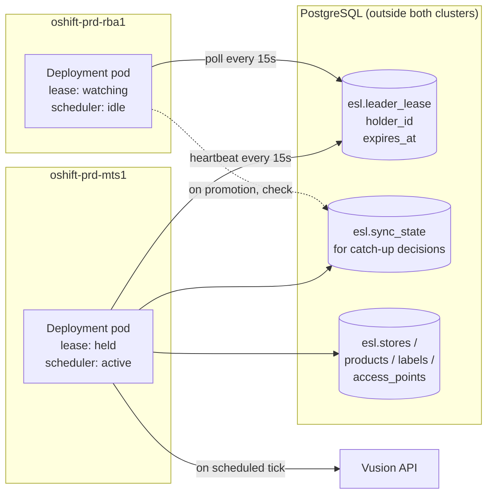
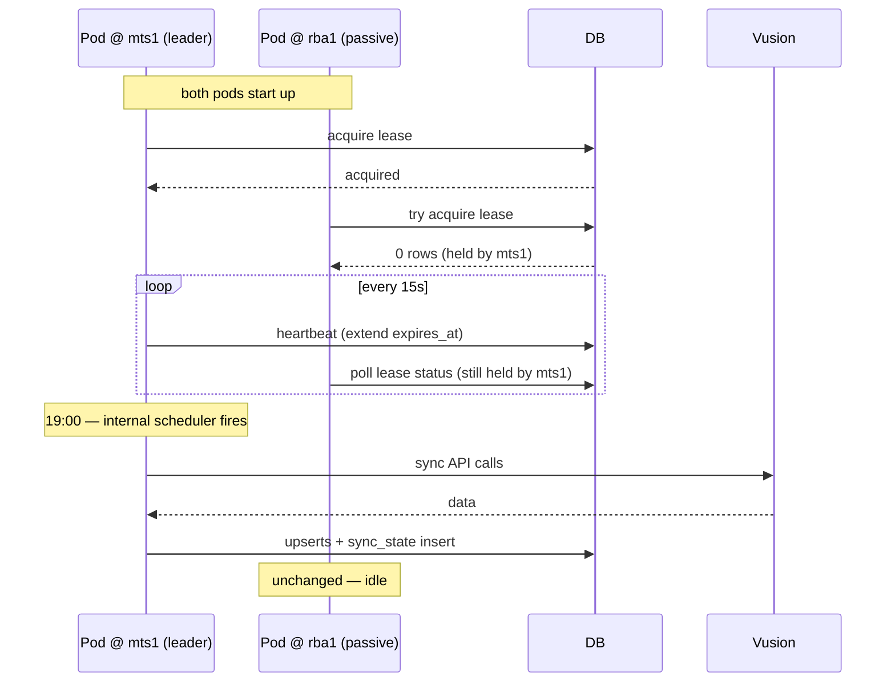
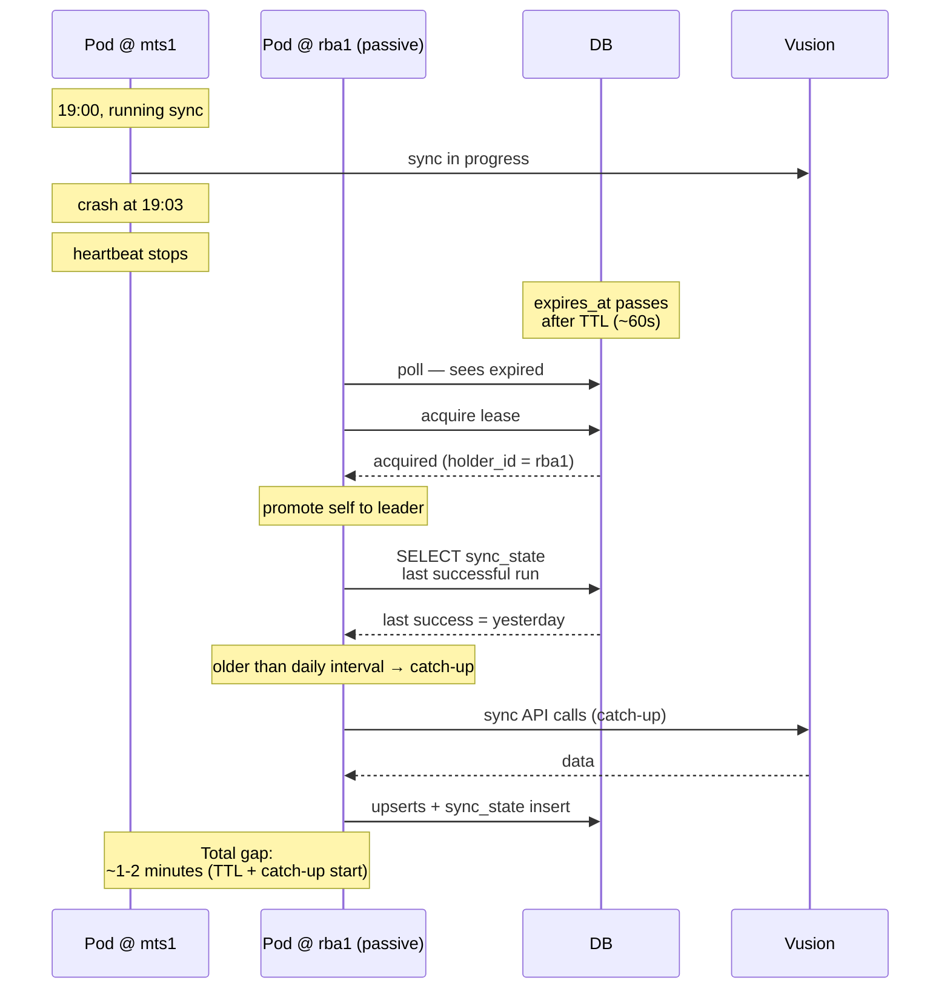
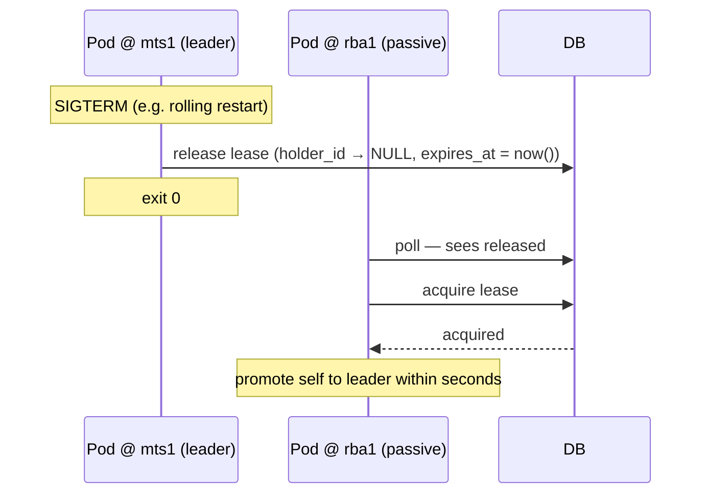

# Option 3 — Deployment with internal scheduler and lease

> **Outcome (2026-04-29):** Option 3 was **not** chosen. Option 1 (config-driven suspend) was selected for `datapipeline`. `event-publisher` is out of scope for active/passive — it stays active/active via `SELECT … FOR UPDATE SKIP LOCKED` on `event_outbox`. Pros/cons below that hinge on architectural symmetry with event-publisher (shared lease primitive, partitioned leases) are obsolete: event-publisher will not adopt a lease.

**One-liner:** replace the CronJob with a long-running Deployment on each cluster. Pods continuously contend for a single database-backed lease; the active pod's in-process scheduler fires the daily sync; the passive pod takes over within seconds if the active one dies. Full automatic failover including mid-run crashes.

## How it works

- The `datapipeline` image is launched as a K8s Deployment (one replica per cluster, two total across the active/active pair).
- On startup, each pod races to acquire the same `esl.leader_lease` row. One becomes leader; the other enters a passive watch loop, polling the lease's `expires_at` on a short interval.
- The leader starts an in-process cron scheduler (e.g. `robfig/cron/v3`) configured with the same schedule that the CronJob previously used (`00 19 * * *` Europe/Lisbon).
- On every scheduled tick, the leader executes the sync: connect to Vusion, write to Postgres. Identical pipeline logic as today — only the entry-point shell changes.
- A background heartbeat keeps the lease's `expires_at` fresh every ~15s. If the heartbeat UPDATE returns 0 rows, the pod self-aborts (fence-token) — the pod's own lease was stolen or expired. K8s restarts it, at which point it rejoins as passive.
- When the passive pod observes an expired lease, it acquires it, promotes itself to leader, and starts its scheduler. As part of promotion, it inspects `sync_state`: if the last successful run is older than the expected interval, it fires an **immediate catch-up sync** rather than waiting for the next 19:00 tick.
- On `SIGTERM`, the leader cleanly releases the lease so the passive pod takes over in seconds rather than waiting for TTL.
- Health endpoints are exposed: `/health` checks Vusion reachability, DB connectivity, and lease status; `/ready` returns 200 only if the pod is currently the leader (so that future `datafetch`/trigger integrations route to the active writer).

## Architecture

## Failover flow — normal operation

## Failover flow — mid-run crash on primary

## Failover flow — graceful shutdown

## What changes

| Repo | File(s) | Change |
|---|---|---|
| `esl/database` | `sql/V1.0.0.21__create_leader_lease.sql` | Same as Option 2. |
| `esl/common` | `common/lease/` | Same library as Option 2, with additional helpers for passive-watcher polling and promotion semantics. |
| `esl/datapipeline` | `cmd/eslorchestrator/` | New entry shape: long-running process with lease + scheduler loops. The existing `run.go` logic (pipeline construction and execution) becomes the body of the scheduler's tick handler. |
| `esl/datapipeline` | New packages `internal/scheduler/` and `internal/health/` | Scheduler wraps `robfig/cron/v3`. Health handlers expose `/health` and `/ready` on a dedicated port. |
| `esl/datapipeline` | `internal/config/` | New blocks: `leader_lease`, `scheduler` (schedule expression, timezone), `health` (port, paths). |
| `esl/k8s` | `helm/templates/datapipeline-cronjob.yaml` | Deleted or renamed to `datapipeline-deployment.yaml`. Kind changes from `CronJob` to `Deployment`; adds `spec.strategy: Recreate` (single replica); adds liveness/readiness probes; removes `schedule`, `concurrencyPolicy`, `jobTemplate`, etc. |
| `esl/k8s` | `helm/templates/network-policy.yaml` | Minor label update to match the new pod-template labels. |

The connector, transformer, sink, and state-store layers are unchanged. This is purely a change of entry shape and scheduling authority.

## Effort

| Task | Size |
|---|---|
| Flyway migration | ~1 hour |
| Lease library + tests (shared with Option 2) | ~1 day |
| Internal scheduler + health probes + config | ~2 days |
| Refactor `run.go` into scheduler-driven handler | ~1 day |
| Helm refactor (CronJob → Deployment) | ~1 day |
| Unit + integration tests for the new entry shape | ~2 days |
| Rollout to PP with ≥1 week of observation | ~1 week |
| Production rollout | ~1 day |
| Runbook updates + ops training | ~1 day |
| **Total** | **~15–20 engineering days, plus one week of soak time in PP** |

## Risks

| Risk | Likelihood | Mitigation |
|---|---|---|
| Regression in the currently-working production pipeline | Medium | Behind a feature flag that allows running with the old CronJob shape in parallel during validation (requires keeping both templates briefly). Large PP soak window. |
| In-process scheduler bug (missed tick, double-fire, DST handling) | Low–Medium | `robfig/cron/v3` is mature; `timeZone` support is well-tested. Table-driven tests for edge cases (DST transitions, leap seconds not relevant at daily resolution). Scheduled runs are recorded in `sync_state` — gap alerts catch missed ticks. |
| Lease TTL race during shutdown: release fails → passive waits full TTL | Low | Release step is idempotent and retried on shutdown. Worst case: ~60s blind window. |
| Catch-up sync on promotion fires at a bad time (e.g., during manual DB maintenance) | Low | Catch-up is gated by config (`scheduler.catchUpOnPromotion: true/false`) and respects the same schedule grace window. |
| Liveness probe failures during a long-running sync cause spurious restarts | Medium | Liveness probe checks process heartbeat, not sync in-flight. Readiness is the one that reflects leadership. Tune `initialDelaySeconds` and `periodSeconds` conservatively. |
| Idle resource cost of two 24/7 pods | Low impact | ~256Mi memory and ~100m CPU per cluster — negligible. |
| Operator confusion (CronJob disappeared; where did the sync go?) | Medium | Updated runbook; kubectl-level guide; internal announcement. |
| Existing observability dashboards (Job history, CronJob metrics) break | Medium | Replace with Deployment/Pod metrics + `sync_state` gap alerts before cutover. |

## Pros

- **True automatic failover including mid-run crashes.** The redundant cluster takes over within seconds to a minute, not tomorrow.
- **Catch-up on promotion.** A missed daily run is re-fired as soon as the new leader realizes.
- **Continuous observability.** Pods are always up, always probeable; you can `kubectl logs` and inspect state any time, not just during the scheduled window.
- **Architectural symmetry with `event-publisher`.** Both stateful writers become long-running Deployments with the same lease primitive. One mental model for the platform.
- **Room to grow.** Ad-hoc triggers (e.g. an HTTP `/run` endpoint for backfill), on-demand reruns, and dynamic scheduling are natural extensions — impossible in the CronJob shape without major rework. Also sets up cleanly for **partitioned leases** on `event-publisher` (N active pods, each owning a hash slice of `entity_key`) — a real near-term need at the 300-store rollout, not a hypothetical. See `00-overview.md` § Scaling context.
- **SIGTERM-aware.** Rolling restarts during ArgoCD syncs release the lease cleanly; takeover is fast.
- **Feature-flaggable and reversible.** Fall back to the CronJob shape by rolling back the Helm change.

## Cons

- **Biggest change and highest risk of regression.** Any bug in the new entry shape affects a pipeline that currently works reliably.
- **Longest rollout window.** The PP soak time alone is about a week to validate scheduler behaviour over multiple daily ticks.
- **New Go dependencies.** `robfig/cron/v3` (or similar), plus health-probe plumbing.
- **Breaks the "cron = K8s CronJob" mental model.** Operators need training. Runbooks and dashboards change.
- **Resource cost (small).** Two pods up 24/7 per env vs. two pods running ~5 min/day.
- **Overlaps scope with Phase 2.** Phase 2 is still rolling out (`event-publisher` k8s PR #30 is open pending ops). Adding a simultaneous Deployment refactor for `datapipeline` stretches ops attention.

## When to pick this

- Mid-run crash recovery same-day is a hard requirement (not "nice to have").
- There is organisational buy-in for a moderate refactor and its rollout window.
- The platform is planning to grow with similar long-running services; the investment in the Deployment shape pays back in consistency across services.
- You want the architectural endpoint now rather than iterating there later via Option 2 → Option 3.

## When NOT to pick this

- When the stated problem is "quota doubling" and the team can tolerate next-day recovery for rare mid-run failures.
- When Phase 2 is still unblocking and the ops capacity is already stretched.
- When the CronJob mental model is deeply embedded in runbooks and observability across the team.

## Note on event-publisher scaling (orthogonal to this option)

This option aligns `datapipeline` architecturally with the `event-publisher` Deployment shape, which makes shared lease semantics natural. It does **not** solve the publisher's throughput problem at 300-store scale.

At ~15M outbox rows during initial CDC sync, the publisher needs **in-pod parallel publishing** (~20 goroutine workers with publish-then-commit-in-fetch-order for ordering). If that single parallelised pod saturates, extend to **partitioned leases** using the same primitive — add a `partition_key` column to `event_outbox` and give each active pod its own partition lease. This is additive to the lease library built for this option.

See `00-overview.md` § Scaling context for the numbers and pre-flip sizing checks.

## What to do next if this option is chosen

1. Ratify scope: confirm that same-day mid-run recovery is worth the effort vs. Option 2.
2. Open a scoped plan at `esl-documentation/plans/active-passive-deployment.md` covering lease + scheduler + health + Helm restructure as a single unit.
3. Land the lease migration first (same as Option 2) — low-risk, reusable by `event-publisher` later regardless of the final choice for `datapipeline`.
4. Build `esl/common/lease` with the extended passive-watcher API.
5. Build the new `datapipeline` entry point alongside the existing `run.go` — both coexist in the binary behind a config flag (`entry: cronjob|deployment`) so they can be rolled forward and back via config.
6. In Helm, add the Deployment manifest alongside the CronJob (with mutually-exclusive toggles) so rollout and rollback are both one config change.
7. Enable Deployment mode in PP. Observe ≥1 week covering weekday + weekend + a simulated pod kill.
8. Once stable, remove the CronJob manifest and the old entry shape. Update runbooks.
9. Apply the same lease primitive to `event-publisher` as part of its Phase 2 rollout.
