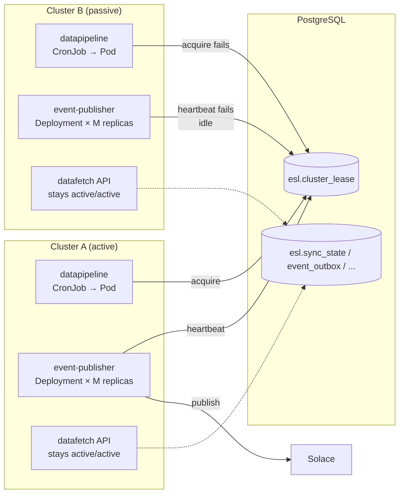

# Active/Passive Orchestration — Workload-Level Database Lease

## Context

ESL is deployed across **N clusters per environment**: dev runs on a single cluster (`rba-d1`); pre-production and production each run on two (`oshift-pp-{rba1,mts1}` and `oshift-prd-{rba1,mts1}` respectively). Where N ≥ 2, exactly one cluster must run the stateful workloads at any given time. Today's mechanism for that is **manual** — Option 1 (`config-driven.md`) gates `datapipeline` via an `activeCluster` value injected into the chart by ArgoCD `helm.parameters`; an operator edits the value during a cluster outage. This plan replaces it with an **automatic** mechanism driven from inside the ESL application code, that works uniformly for any N ≥ 1.

**Drivers for the change:**

1. Client requires unattended failover on cluster outage — no manual values-file edit, no operator involvement.
2. Ops have signalled `helm.parameters` is a temporary mechanism and want it removed.
3. The failover decision must orchestrate **every stateful service** centrally, not be re-implemented per workload, and must degrade transparently to a no-op when the environment has only one cluster.

**Two prior decisions are reversed:**

- The 2026-04-29 descope of `event-publisher` from active/passive is reversed — it is back in scope, gated by the same lease as `datapipeline`. The previous hot-standby property (events processed on either cluster) is traded for the central-orchestration property the client requires.
- The Option 3 draft (`plans/drafts/active-passive-deployment-scheduler.md`) is no longer the planned endpoint — workload-level lease without a Deployment-shape refactor delivers automatic failover at smaller scope.

**Out of scope:**

- `datafetch` REST API — stays active/active for stateless redundancy. (Assumption — to confirm.)
- Scaling passive replicas to zero — passive replicas stay idle (per client decision in this conversation).
- Any cross-cluster networking, DNS, or GLB changes.

## Goal

A single Postgres-arbitrated cluster lease governs which cluster in an environment runs the gated workloads. Lease holder = active cluster. With N=1 the sole cluster trivially holds the lease forever; with N≥2 exactly one cluster holds it at any time and takeover happens automatically on TTL expiry. Each gated workload checks the lease internally:

- `datapipeline` (CronJob): acquires the lease at run start; skips the run if not acquired.
- `event-publisher` (Deployment, M replicas): heartbeats the lease in the background; processes events only while its cluster holds the lease.

Failover RTO ≈ lease TTL (configurable, defaulting to per-workload values tuned in PP). No operator action.

## Architecture



Diagram shows the N=2 case (PP, PRD). For N=1 (dev), only one column exists; the lone cluster's replicas acquire the lease uncontested and the second branch is empty. Inter-cluster arbitration: only one cluster's replicas can hold the lease. Intra-cluster cooperation: any replica in the holder cluster keeps the lease alive via heartbeat.

## Cluster topology (N=1 vs N≥2)

| Environment | Clusters | Behaviour under this plan |
|---|---|---|
| dev | 1 (`rba-d1`) | Sole cluster acquires the lease on first call; `AmIActive() = true` always; no failover possible. Lease is one extra DB round-trip per heartbeat — negligible overhead. Same code path as multi-cluster environments. |
| pp | 2 (`oshift-pp-rba1`, `oshift-pp-mts1`) | Standard automatic failover: lease holder runs the workloads, peer idles. Failover on TTL expiry. |
| prd | 2 (`oshift-prd-rba1`, `oshift-prd-mts1`) | Same as PP. |
| future env with N>2 | N | The lease generalises: exactly one cluster holds it at any time, regardless of N. |

The same chart, the same workload code, and the same lease library handle all three current cases. Setting `cluster_lease.enabled: false` is available as an opt-out for environments that want zero overhead, but the default is enabled everywhere so the code path is uniform — there is no `if singleCluster` branch in any service.

## Data model

`esl/database/sql/V1.0.0.21__create_cluster_lease.sql`:

```sql
CREATE TABLE esl.cluster_lease (
    lease_name      TEXT        PRIMARY KEY,
    holder          TEXT        NOT NULL,
    acquired_at     TIMESTAMPTZ NOT NULL,
    expires_at      TIMESTAMPTZ NOT NULL,
    heartbeat_at    TIMESTAMPTZ NOT NULL
);
```

One row per named lease. The single lease used by this plan is `esl-active-cluster`. The schema is intentionally narrow — partition keys, fence tokens, and per-pipeline leases can be added later (additive columns, no compatibility break).

## Lease library — `esl/common/lease`

API:

```go
package lease

type LeaseName string

const ActiveClusterLease LeaseName = "esl-active-cluster"

// Acquire takes (or refreshes) the lease for clusterName.
// acquired=true if this cluster now holds the lease.
// Idempotent when clusterName already holds it.
func Acquire(ctx context.Context, db *sql.DB, name LeaseName, clusterName string, ttl time.Duration) (acquired bool, err error)

// Heartbeat refreshes the lease's expiry. held=false means the lease was lost.
func Heartbeat(ctx context.Context, db *sql.DB, name LeaseName, clusterName string, ttl time.Duration) (held bool, err error)

// GetHolder returns the current holder (or "" if expired/unset).
func GetHolder(ctx context.Context, db *sql.DB, name LeaseName) (holder string, expiresAt time.Time, err error)

// Watcher tracks a long-running "am I active?" state with periodic heartbeats.
type Watcher struct { /* private */ }

func NewWatcher(db *sql.DB, name LeaseName, clusterName string, ttl, refresh time.Duration) *Watcher
func (w *Watcher) Start(ctx context.Context) error  // returns after the first acquire attempt
func (w *Watcher) AmIActive() bool
```

Atomic acquire/heartbeat SQL (one statement, executed under read-committed):

```sql
INSERT INTO esl.cluster_lease (lease_name, holder, acquired_at, expires_at, heartbeat_at)
VALUES ($1, $2, NOW(), NOW() + ($3 || ' seconds')::INTERVAL, NOW())
ON CONFLICT (lease_name) DO UPDATE SET
    holder       = EXCLUDED.holder,
    acquired_at  = CASE WHEN esl.cluster_lease.holder = EXCLUDED.holder
                        THEN esl.cluster_lease.acquired_at
                        ELSE EXCLUDED.acquired_at END,
    expires_at   = EXCLUDED.expires_at,
    heartbeat_at = EXCLUDED.heartbeat_at
WHERE esl.cluster_lease.holder = EXCLUDED.holder
   OR esl.cluster_lease.expires_at < NOW()
RETURNING (xmax = 0) OR (esl.cluster_lease.holder = $2) AS acquired;
```

Tests using `internal/testutil/` shared container helper:

- Fresh acquire on empty table.
- Idempotent re-acquire by same holder.
- Failed acquire while other holder is healthy.
- Successful acquire after other holder's lease expires.
- Heartbeat refreshes expiry while holding.
- Heartbeat returns `held=false` after another cluster has stolen the lease.
- Concurrent acquire from two clusters: exactly one wins.

## Workload integration

### datapipeline

In `cmd/eslorchestrator/run.go`, at the top of `Run()`:

```go
clusterName := os.Getenv("CLUSTER_NAME") // already in the pod env
acquired, err := lease.Acquire(ctx, db, lease.ActiveClusterLease, clusterName, cfg.LeaseTTL)
if err != nil {
    return fmt.Errorf("cluster lease acquire: %w", err)
}
if !acquired {
    log.Info().Str("cluster", clusterName).Msg("not the active cluster; skipping run")
    return nil
}
go heartbeatLoop(ctx, db, clusterName, cfg)
// existing pipeline follows
```

`heartbeatLoop` refreshes the lease every `cfg.LeaseRefreshInterval` (default 1/4 of TTL). On `held=false`, it cancels the run context — fence pattern (a slow heartbeat raced by a faster peer aborts the slow run before duplicate work happens).

New config block in `internal/config/`:

```yaml
cluster_lease:
  enabled: true
  ttl_seconds: 3600            # 1h — datapipeline runs are bounded
  refresh_interval_seconds: 900
```

### event-publisher

Wrap the main publish loop with a `Watcher`:

```go
watcher := lease.NewWatcher(db, lease.ActiveClusterLease, clusterName, cfg.LeaseTTL, cfg.LeaseRefresh)
if err := watcher.Start(ctx); err != nil { return err }

for {
    select {
    case <-ctx.Done(): return nil
    case <-time.After(cfg.PollInterval):
    }
    if !watcher.AmIActive() {
        continue
    }
    // existing batch-publish logic (SELECT ... FOR UPDATE SKIP LOCKED)
}
```

The `Watcher` runs a goroutine that periodically calls `Heartbeat`. If `held=false`, it tries `Acquire` again; on success, `AmIActive()` flips back to `true`. All N replicas in the active cluster run this loop independently and all see `AmIActive=true` (they cooperatively refresh the same lease row; the SQL is idempotent for matching holder). All N replicas in the passive cluster see `AmIActive=false` and idle.

Readiness probe gated on `watcher.Start(ctx)` returning — prevents the pod being considered Ready before the first acquire attempt, which would otherwise allow a publish before the lease state is known.

New config block:

```yaml
cluster_lease:
  enabled: true
  ttl_seconds: 60
  refresh_interval_seconds: 15
```

Shorter TTL than datapipeline because event-publisher needs fast failover for the event stream.

## Helm chart cleanup (deprecation of `activeCluster`)

After dev/PP verify the lease takes over:

- `clusters/cluster-{dev,preproduction,production}/values-{dev,pp,prd}.yaml`: remove the `activeCluster` line.
- `helm/templates/datapipeline-cronjob.yaml:261` becomes:
  ```yaml
  suspend: {{ $dp.suspend | default false }}
  ```
  (preserves the manual maintenance toggle from PR #41; drops the cluster check.)
- `helm/templates/eventpublisher-deployment.yaml:161` becomes:
  ```yaml
  replicas: {{ $ep.replicaCount | default 1 }}
  ```
- ArgoCD `helm.parameters` for `activeCluster` removed from the foundations repo (ops action; the `clusterName` parameter stays — workloads still need it for the lease).

All Argos in each environment now reconcile identical manifests across every cluster in that environment. No `ignoreDifferences`, no per-cluster Helm parameters beyond `clusterName`. In N=1 environments (dev) this is already the case today; the change is meaningful only for N≥2.

## Implementation milestones

The repo policies to follow are documented in feedback memory: `database` goes direct to main; `common`, `datapipeline`, `event-publisher` use plain feature branches; `k8s` uses feature branches + PR to `testing`.

### Milestone 1 — Database migration

- Land `V1.0.0.21__create_cluster_lease.sql` directly on `database` main.
- Verify table exists in dev DB.

### Milestone 2 — Lease library

- Feature branch in `common`.
- Implement `Acquire`, `Heartbeat`, `GetHolder`, `Watcher` per the API above.
- Unit tests + integration tests via `internal/testutil/`.

### Milestone 3 — datapipeline integration

- Feature branch in `datapipeline`.
- Wire lease into `cmd/eslorchestrator/run.go`.
- Add `cluster_lease` config block.
- Behind feature flag (`cluster_lease.enabled`), default **off**.

### Milestone 4 — event-publisher integration

- Feature branch in `event-publisher`.
- Wire `Watcher` into the publish loop.
- Add `cluster_lease` config block.
- Behind same feature flag, default **off**.
- Gate readiness probe on first acquire attempt.

### Milestone 5 — Dev rollout (single-cluster validation, N=1)

- Flip `cluster_lease.enabled: true` in dev values.
- Confirm `datapipeline` acquires the lease and runs.
- Confirm `event-publisher` reports `AmIActive() = true` and processes events normally.
- `SELECT * FROM esl.cluster_lease;` in the dev DB shows `holder = 'rba-d1'` with a recent `heartbeat_at`.
- No failover test possible (single cluster); this milestone validates the N=1 code path. Multi-cluster failover is exercised in Milestone 6.

### Milestone 6 — PP rollout (parallel mechanism)

- Flip `cluster_lease.enabled: true` in PP values.
- The Helm `activeCluster` gating stays in place — both mechanisms run simultaneously. The lease is redundant safety while the Helm gating still suspends the passive cluster's CronJob.
- Observation window: ≥ 1 week.
- Failover test: kill event-publisher pods on the active cluster → lease expires within TTL → passive cluster's watchers flip `AmIActive=true` → publishing resumes there. Restart the original cluster, confirm it stays idle.
- Flip `activeCluster` (Option 1's manual mechanism) and confirm the lease mechanism agrees.

### Milestone 7 — Helm cleanup

- Feature branch in `k8s`: removes `activeCluster` and the per-template gating expressions.
- PR to `testing`.
- Verify on PP: both clusters deploy identical manifests; passive cluster's workloads idle via lease check only.

### Milestone 8 — Production rollout

- Promote PP-tested chart to prd.
- Coordinate with ops to remove `activeCluster` from foundations-repo `helm.parameters`.
- Observation window: 1 month.

### Milestone 9 — Documentation

- Update `phase-2/06-deployment.md`: replace the "Active/Passive Failover" content with the lease-based mechanism.
- Update `phase-2/07-operations.md`: revise the runbook (no `activeCluster` to edit; instead, inspect `esl.cluster_lease` and force failover by demoting the active cluster's heartbeat).
- Add Prometheus alert: `esl_cluster_lease_stale_heartbeat_5m` — fires if `heartbeat_at` for `esl-active-cluster` is older than 5 minutes (catches both clusters' watchers failing).

## Verification checklist (per environment)

- [ ] `SELECT * FROM esl.cluster_lease WHERE lease_name = 'esl-active-cluster';` returns the expected holder.
- [ ] `heartbeat_at` is recent (within `refresh_interval_seconds × 2`).
- [ ] `datapipeline` next-run logs show "acquired" on active and "skipping run" on passive.
- [ ] `event-publisher` logs show `AmIActive=true` on active cluster; on passive clusters (N≥2 envs) `AmIActive=false`.
- [ ] (N≥2 envs only) Failover test executed: kill active replicas, confirm passive flips active within `TTL + refresh_interval`.
- [ ] After Milestone 7: `helm template` produces identical manifests for both clusters.
- [ ] Prometheus alert `esl_cluster_lease_stale_heartbeat_5m` configured.

## Rollback

- Per milestone: setting `cluster_lease.enabled: false` reverts each workload to "always run" behavior; the Helm `activeCluster` gating (still in place through Milestone 6) keeps the passive cluster suspended.
- After Milestone 7: rollback means reverting the `k8s` PR that removed the `activeCluster` gating. The lease table can stay; setting `cluster_lease.enabled: false` is sufficient to disable the new mechanism.

## Risks

| Risk | Likelihood | Mitigation |
|---|---|---|
| Lease TTL too short → spurious flips under DB latency spikes | Low–Medium | Configurable per env and per workload. Start generous; tighten only after observation. Fence pattern (heartbeat `held=false` aborts in-flight run) makes a brief flip safe, not corrupting. |
| Lease TTL too long → slow takeover on cluster outage | Low | Same — configurable. Default targets: 60s for event-publisher, 1h for datapipeline. |
| Bug in lease SQL → both clusters acquire simultaneously | Low | Integration test with concurrent acquires. Client tolerates the worst-case (quota burn, fails gracefully). |
| DB outage → no one holds the lease → all gated workloads idle | Low (matches existing dep) | All ESL workloads already depend on the shared Postgres; if DB is down the system is down regardless of cluster role. |
| Loss of event-publisher hot-standby benefit | Accepted | Explicit trade-off for central orchestration. Single-active is what the client asked for. |
| Boot race in N≥2 envs: multiple clusters' workloads start before any acquire completes | Low | event-publisher readiness probe gated on the first acquire attempt. datapipeline acquires before any Vusion call. Not applicable for N=1. |
| Operator-forced failover during incident | Medium need | Runbook documents `UPDATE esl.cluster_lease SET expires_at = NOW() WHERE holder = '<cluster>'` to force a flip. |

## Open questions

1. **`datafetch` scope** — confirm `datafetch` (REST API) stays active/active for redundancy, or also moves to single-active. Default assumption in this plan: active/active.
2. **Lease TTL final values** — initial guess: event-publisher = 60s, datapipeline = 3600s. Will tune in PP based on observed DB jitter.
3. **Single-lease vs per-workload leases** — current design uses one shared `esl-active-cluster` lease for both workloads. Alternative: separate leases (`esl-datapipeline`, `esl-event-publisher`) — allows split-brain by workload (e.g., datapipeline runs on cluster A while event-publisher runs on cluster B). Rejected as the default since the client wants central orchestration, but the schema supports it if a future use case demands.

## Links

- Comparison report this plan generalises: `02-cronjob-with-lease.md` (originally datapipeline-only; extended here to event-publisher).
- Superseded plan: `config-driven.md` (Option 1 — manual failover, currently deployed in PP for datapipeline).
- Deferred draft, no longer the planned endpoint: `plans/drafts/active-passive-deployment-scheduler.md`.
- Event-publisher throughput, orthogonal to this plan: `plans/drafts/event-publisher-parallel-publishing.md`.
- Repo policies: feedback memories `database_direct_main`, `k8s_no_direct_testing`, `datapipeline_no_worktrees`, `test_containers_shared_helper`.
